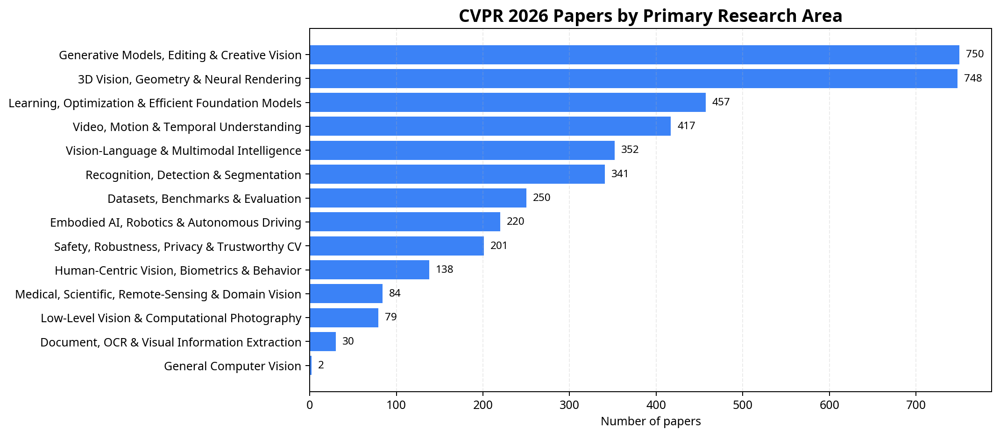
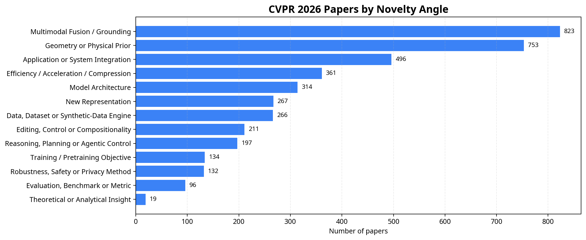

# CVPR 2026 Research Map

**A high-level map of CVPR 2026 by research area, novelty angle, and improvement mechanism.**

This page adds a strategic browsing layer on top of the full paper index. It is meant to help readers quickly answer questions such as: **Which areas dominate the conference? Which methodological patterns recur? Which papers are likely improving quality, speed, robustness, controllability, or 3D consistency?** The labels are generated from CVF titles and abstracts and should be treated as a discovery aid rather than a definitive classification.

The current categorized dataset contains **4,069 CVF Open Access papers** with abstracts. The two largest automated areas, **Generative Models, Editing & Creative Vision** and **3D Vision, Geometry & Neural Rendering**, account for **1,498 papers** or **36.8%** of the parsed index. This aligns with public CVPR 2026 trend commentary that highlights the rise of multimodal, generative, video, and embodied directions alongside continued depth in 3D and geometry.[1] [2]

## Area Distribution and Code Availability

| Primary area | Papers | Share | With code/resource | Direct GitHub |
|---|---:|---:|---:|---:|
| Generative Models, Editing & Creative Vision | 750 | 18.4% | 161 | 110 |
| 3D Vision, Geometry & Neural Rendering | 748 | 18.4% | 156 | 83 |
| Learning, Optimization & Efficient Foundation Models | 457 | 11.2% | 111 | 103 |
| Video, Motion & Temporal Understanding | 417 | 10.2% | 88 | 60 |
| Vision-Language & Multimodal Intelligence | 352 | 8.7% | 77 | 55 |
| Recognition, Detection & Segmentation | 341 | 8.4% | 99 | 86 |
| Datasets, Benchmarks & Evaluation | 250 | 6.1% | 79 | 48 |
| Embodied AI, Robotics & Autonomous Driving | 220 | 5.4% | 41 | 23 |
| Safety, Robustness, Privacy & Trustworthy CV | 201 | 4.9% | 50 | 46 |
| Human-Centric Vision, Biometrics & Behavior | 138 | 3.4% | 30 | 17 |
| Medical, Scientific, Remote-Sensing & Domain Vision | 84 | 2.1% | 23 | 20 |
| Low-Level Vision & Computational Photography | 79 | 1.9% | 28 | 26 |
| Document, OCR & Visual Information Extraction | 30 | 0.7% | 9 | 8 |
| General Computer Vision | 2 | 0.0% | 0 | 0 |

## Novelty Angles

| Novelty angle | Papers | Share |
|---|---:|---:|
| Multimodal Fusion / Grounding | 823 | 20.2% |
| Geometry or Physical Prior | 753 | 18.5% |
| Application or System Integration | 496 | 12.2% |
| Efficiency / Acceleration / Compression | 361 | 8.9% |
| Model Architecture | 314 | 7.7% |
| New Representation | 267 | 6.6% |
| Data, Dataset or Synthetic-Data Engine | 266 | 6.5% |
| Editing, Control or Compositionality | 211 | 5.2% |
| Reasoning, Planning or Agentic Control | 197 | 4.8% |
| Training / Pretraining Objective | 134 | 3.3% |
| Robustness, Safety or Privacy Method | 132 | 3.2% |
| Evaluation, Benchmark or Metric | 96 | 2.4% |
| Theoretical or Analytical Insight | 19 | 0.5% |

## Improvement Axes

| Improvement axis | Papers | Share |
|---|---:|---:|
| Accuracy / Quality | 1,147 | 28.2% |
| 3D / Physical Consistency | 932 | 22.9% |
| Temporal Consistency | 554 | 13.6% |
| Generalization / Robustness | 445 | 10.9% |
| Efficiency / Speed | 290 | 7.1% |
| Scalability | 195 | 4.8% |
| Controllability / Editability | 186 | 4.6% |
| Evaluation Clarity | 144 | 3.5% |
| Safety / Trustworthiness | 109 | 2.7% |
| Data Efficiency | 67 | 1.6% |

## How to Use This Map

Readers doing a literature review should start with the **primary area** and then filter by **novelty angle**. Engineers looking for reproducible work should filter `code_resource_found == Yes` and then inspect `github`, `website`, and `model_demo`. Founders or applied teams should pay special attention to `improvement_axis`, because it separates papers targeting quality from those targeting speed, controllability, scalability, safety, or deployability.

| Goal | Recommended filter |
|---|---|
| Find fast or deployable methods | `novelty_angle = Efficiency / Acceleration / Compression` or `improvement_axis = Efficiency / Speed`. |
| Find new foundation-model training ideas | `primary_area = Learning, Optimization & Efficient Foundation Models` plus `novelty_angle = Training / Pretraining Objective`. |
| Find project-ready methods | `code_resource_found = Yes`, then sort by `primary_area` and inspect `github` or `website`. |
| Find papers with a clear evaluation contribution | `primary_area = Datasets, Benchmarks & Evaluation` or `novelty_angle = Evaluation, Benchmark or Metric`. |
| Find likely high-growth research themes | Review generative, 3D, multimodal, video, embodied, and safety categories together. |

## Representative Papers by Area

The tables below intentionally show a small, code-prioritized slice of each area. The complete grouped index is available in [`papers-by-category.md`](papers-by-category.md), and the machine-readable version is available in [`data/cvpr2026_papers_categorized.csv`](data/cvpr2026_papers_categorized.csv).

### Generative Models, Editing & Creative Vision

Papers that create, edit, synthesize, or control visual media, including diffusion, flow matching, image/video generation, style transfer, and creative reconstruction pipelines. In this automated map, the area contains **750 papers** and **161 discovered code/resource entries**.

| Example paper | Code/resource | GitHub | arXiv | Novelty angle | Improvement axis | Improvement rationale |
|---|---|---|---|---|---|---|
| [ACPV-Net: All-Class Polygonal Vectorization for Seamless Vector Map Generation from Aerial Imagery](https://openaccess.thecvf.com/content/CVPR2026/html/Jiao_ACPV-Net_All-Class_Polygonal_Vectorization_for_Seamless_Vector_Map_Generation_from_CVPR_2026_paper.html) | Yes | [GitHub](https://github.com/HeinzJiao/ACPV-Net) | [arXiv](https://arxiv.org/abs/2603.16616) | Geometry or Physical Prior | 3D / Physical Consistency | Targets 3d / physical consistency in generative models, editing & creative vision by using geometry or physical prior. Evidence: We tackle the problem of generating a complete vector map representation from aerial imagery in a single run: producing polygons for all land-cover classes with shared boundaries and without gaps or overlaps. |
| [Accelerating Diffusion Model Training under Minimal Budgets: A Condensation-Based Perspective](https://openaccess.thecvf.com/content/CVPR2026/html/Huang_Accelerating_Diffusion_Model_Training_under_Minimal_Budgets_A_Condensation-Based_Perspective_CVPR_2026_paper.html) | Yes | [GitHub](https://github.com/xie-lab-ml/Diffusion-Dataset-Condensation) | [arXiv](https://arxiv.org/abs/2507.05914) | Data, Dataset or Synthetic-Data Engine | Accuracy / Quality | Targets accuracy / quality in generative models, editing & creative vision by using data, dataset or synthetic-data engine. Evidence: On ImageNet 256x256 with SiT-XL/2, D2C attains a FID of 4.3 in just 40k steps using only 0.8% of the training images, corresponding to about 233x and 100x faster training than vanilla SiT-XL/2 and SiT-XL/2 + REPA, respectively |
| [Accelerating Diffusion via Hybrid Data-Pipeline Parallelism Based on Conditional Guidance Scheduling](https://openaccess.thecvf.com/content/CVPR2026/html/Jung_Accelerating_Diffusion_via_Hybrid_Data-Pipeline_Parallelism_Based_on_Conditional_Guidance_CVPR_2026_paper.html) | Yes | [GitHub](https://github.com/kaist-dmlab/Hybridiff) | [arXiv](https://arxiv.org/abs/2602.21760) | Application or System Integration | Efficiency / Speed | Targets efficiency / speed in generative models, editing & creative vision by using application or system integration. Evidence: Nevertheless, current diffusion acceleration methods based on distributed parallelism suffer from noticeable generation artifacts and fail to achieve substantial acceleration proportional to the number of GPUs. |
| [Adapting In-context Generation for Enhanced Composed Image Retrieval](https://openaccess.thecvf.com/content/CVPR2026/html/Li_Adapting_In-context_Generation_for_Enhanced_Composed_Image_Retrieval_CVPR_2026_paper.html) | Yes | [GitHub](https://github.com/JThuge/DAIG) |  | Multimodal Fusion / Grounding | Generalization / Robustness | Targets generalization / robustness in generative models, editing & creative vision by using multimodal fusion / grounding. Evidence: To this end, we shift the focus to developing robust CIR models under limited labeled data and propose Domain-Adaptive In-context Generation (DAIG), which adapts the in-context capability of a pretrained Text-to-Image (T2I) mo |
| [Advancing Image Classification with Discrete Diffusion Classification Modeling](https://openaccess.thecvf.com/content/CVPR2026/html/Belhasin_Advancing_Image_Classification_with_Discrete_Diffusion_Classification_Modeling_CVPR_2026_paper.html) | Yes | [GitHub](https://github.com/omerb01/didicm) |  | Application or System Integration | Accuracy / Quality | Targets accuracy / quality in generative models, editing & creative vision by using application or system integration. Evidence: We conduct a comprehensive empirical study demonstrating the superior performance of DiDiCM over standard classifiers, showing that a few diffusion iterations achieve higher classification accuracy on the ImageNet dataset compared  |
| [Align Images Before You Generate](https://openaccess.thecvf.com/content/CVPR2026/html/Zhang_Align_Images_Before_You_Generate_CVPR_2026_paper.html) | Yes | [GitHub](https://github.com/SuhZhang/CorrAdapter) |  | Model Architecture | Temporal Consistency | Targets temporal consistency in generative models, editing & creative vision by using model architecture. Evidence: Experiments on both static multi-view generation and dynamic video generation show that CorrAdapter consistently improves spatiotemporal consistency and perceptual quality over strong baselines, offering a simple yet versatile drop-in approach  |
| [Anatomica: Localized Control over Geometric and Topological Properties for Anatomical Diffusion Models](https://openaccess.thecvf.com/content/CVPR2026/html/Kadry_Anatomica_Localized_Control_over_Geometric_and_Topological_Properties_for_Anatomical_CVPR_2026_paper.html) | Yes | [GitHub](https://github.com/kkadry/Anatomica) | [arXiv](https://arxiv.org/abs/2511.20587) | Editing, Control or Compositionality | 3D / Physical Consistency | Targets 3d / physical consistency in generative models, editing & creative vision by using editing, control or compositionality. Evidence: Finally, we adapt this framework for latent diffusion models, where a neural field decoder can partially extract substructures, enabling efficient measurement and control of anatomical features. |
| [Are We Ready for RL in Text-to-3D Generation? A Progressive Investigation](https://openaccess.thecvf.com/content/CVPR2026/html/Tang_Are_We_Ready_for_RL_in_Text-to-3D_Generation_A_Progressive_CVPR_2026_paper.html) | Yes | [GitHub](https://github.com/Ivan-Tang-3D/3DGen-R1) | [arXiv](https://arxiv.org/abs/2512.10949) | Geometry or Physical Prior | 3D / Physical Consistency | Targets 3d / physical consistency in generative models, editing & creative vision by using geometry or physical prior. Evidence: To address these challenges, we conduct the first systematic study of RL for text-to-3D autoregressive generation across several dimensions. (1) Reward designs: We evaluate reward dimensions and model choices, showing that alignmen |
| [Attribution as Retrieval: Model-Agnostic AI-Generated Image Attribution](https://openaccess.thecvf.com/content/CVPR2026/html/Wang_Attribution_as_Retrieval_Model-Agnostic_AI-Generated_Image_Attribution_CVPR_2026_paper.html) | Yes | [GitHub](https://github.com/hongsong-wang/LIDA) | [arXiv](https://arxiv.org/abs/2603.10583) | Application or System Integration | Accuracy / Quality | Targets accuracy / quality in generative models, editing & creative vision by using application or system integration. Evidence: We propose an efficient model-agnostic framework, called Low-bIt-plane-based Deepfake Attribution (LIDA). |
| [AutoCut: End-to-end advertisement video editing based on multimodal discretization and controllable generation](https://openaccess.thecvf.com/content/CVPR2026/html/Zhou_AutoCut_End-to-end_advertisement_video_editing_based_on_multimodal_discretization_and_CVPR_2026_paper.html) | Yes | [GitHub](https://github.com/AdAutoCut/Autocut) | [arXiv](https://arxiv.org/abs/2603.28366) | Multimodal Fusion / Grounding | Controllability / Editability | Targets controllability / editability in generative models, editing & creative vision by using multimodal fusion / grounding. Evidence: Short-form videos have become a primary medium for digital advertising, requiring scalable and efficient content creation. |
### 3D Vision, Geometry & Neural Rendering

Papers focused on 3D understanding, multiview geometry, depth, pose, reconstruction, neural rendering, Gaussian splatting, SLAM, point clouds, meshes, and radiance-field style representations. In this automated map, the area contains **748 papers** and **156 discovered code/resource entries**.

| Example paper | Code/resource | GitHub | arXiv | Novelty angle | Improvement axis | Improvement rationale |
|---|---|---|---|---|---|---|
| [$L^{2}DGS$: Low-Light Dynamic Gaussian Splatting](https://openaccess.thecvf.com/content/CVPR2026/html/Kumar_L2DGS_Low-Light_Dynamic_Gaussian_Splatting_CVPR_2026_paper.html) | Yes | [GitHub](https://github.com/akumar005/L2DGS) |  | New Representation | Temporal Consistency | Targets temporal consistency in 3d vision, geometry & neural rendering by using new representation. Evidence: While recent Neural Radiance Field (NeRF) and Gaussian Splatting (GS) methods enable 4D dynamic scene reconstruction, they predominantly assume well-lit inputs. |
| [240FPS Stereo Vision from Monocular Mixed Spikes](https://openaccess.thecvf.com/content/CVPR2026/html/Xiaokaiti_240FPS_Stereo_Vision_from_Monocular_Mixed_Spikes_CVPR_2026_paper.html) | Yes | [GitHub](https://github.com/yongqiye00/MonoSpikeStereo) |  | Efficiency / Acceleration / Compression | Temporal Consistency | Targets temporal consistency in 3d vision, geometry & neural rendering by using efficiency / acceleration / compression. Evidence: Binocular and multi-view systems improve accuracy but incur higher hardware complexity and data inefficiency. |
| [3D sans 3D Scans: Scalable Pre-training from Video-Generated Point Clouds](https://openaccess.thecvf.com/content/CVPR2026/html/Yamada_3D_sans_3D_Scans_Scalable_Pre-training_from_Video-Generated_Point_Clouds_CVPR_2026_paper.html) | Yes | [GitHub](https://github.com/ryosuke-yamada/lam3c) | [arXiv](https://arxiv.org/abs/2512.23042) | Training / Pretraining Objective | Data Efficiency | Targets data efficiency in 3d vision, geometry & neural rendering by using training / pretraining objective. Evidence: Despite recent progress in 3D self-supervised learning, collecting large-scale 3D scene scans remains expensive and labor-intensive. |
| [4D Local Modeling Toward Dynamic Global Perception for Ambiguity-free Rotation-Invariant Point Cloud Analysis](https://openaccess.thecvf.com/content/CVPR2026/html/Guo_4D_Local_Modeling_Toward_Dynamic_Global_Perception_for_Ambiguity-free_Rotation-Invariant_CVPR_2026_paper.html) | Yes | [GitHub](https://github.com/jiaxunguo/ga4dpf) |  | Geometry or Physical Prior | 3D / Physical Consistency | Targets 3d / physical consistency in 3d vision, geometry & neural rendering by using geometry or physical prior. Evidence: To overcome these limitations, we propose Ga4DPF, a novel framework that offers a robust, global-aware RI representation by converting rotation-equivariant geometric representations into invariant ones, while concurrently integrating glo |
| [A Difference-in-Difference Approach to Detecting AI-Generated Images](https://openaccess.thecvf.com/content/CVPR2026/html/Qi_A_Difference-in-Difference_Approach_to_Detecting_AI-Generated_Images_CVPR_2026_paper.html) | Yes | [GitHub](https://github.com/Qixinyi1122-lucky/DID) | [arXiv](https://arxiv.org/abs/2602.23732) | Application or System Integration | Accuracy / Quality | Targets accuracy / quality in 3d vision, geometry & neural rendering by using application or system integration. Evidence: Extensive experiments demonstrate that our method achieves strong generalization performance, enabling reliable detection of AI-generated images in the era of generative AI. |
| [A2GC: Asymmetric Aggregation with Geometric Constraints for Locally Aggregated Descriptors](https://openaccess.thecvf.com/content/CVPR2026/html/Li_A2GC_Asymmetric_Aggregation_with_Geometric_Constraints_for_Locally_Aggregated_Descriptors_CVPR_2026_paper.html) | Yes | [GitHub](https://github.com/CV4RA/A2GC) | [arXiv](https://arxiv.org/abs/2511.14109) | Geometry or Physical Prior | 3D / Physical Consistency | Targets 3d / physical consistency in 3d vision, geometry & neural rendering by using geometry or physical prior. Evidence: State-of-the-art methods aggregate features from deep backbones to form global descriptors. |
| [AERGS-SLAM: Auto-Exposure-Robust Stereo 3D Gaussian Splatting SLAM](https://openaccess.thecvf.com/content/CVPR2026/html/Zhou_AERGS-SLAM_Auto-Exposure-Robust_Stereo_3D_Gaussian_Splatting_SLAM_CVPR_2026_paper.html) | Yes | [GitHub](https://github.com/zzy-2021/AERGS-SLAM) |  | Geometry or Physical Prior | 3D / Physical Consistency | Targets 3d / physical consistency in 3d vision, geometry & neural rendering by using geometry or physical prior. Evidence: To address this issue, we propose a stereo auto-exposure-robust Gaussian splatting SLAM (AERGS-SLAM), a framework robust to such variations and enables both reliable localization and exposure-controlled photorealistic mapping. |
| [Adaptive Anisotropic Gaussian Splatting for Multi-contrast MRI Arbitrary-Scale Super-Resolution with Anatomy Guidance](https://openaccess.thecvf.com/content/CVPR2026/html/Yan_Adaptive_Anisotropic_Gaussian_Splatting_for_Multi-contrast_MRI_Arbitrary-Scale_Super-Resolution_with_CVPR_2026_paper.html) | Yes | [GitHub](https://github.com/Qiuhai-CV/GaussM2ASR) |  | New Representation | Scalability | Targets scalability in 3d vision, geometry & neural rendering by using new representation. Evidence: Implicit neural representation (INR) based methods learn a continuous mapping from a low-resolution (LR) target magnetic resonance (MR) image and a high-resolution (HR) reference image to achieve arbitrary-scale super-resolution (SR). |
| [Bridging the 2D-3D Gap: A Hierarchical Semantic-Geometric Map for Vision Language Navigation](https://openaccess.thecvf.com/content/CVPR2026/html/Li_Bridging_the_2D-3D_Gap_A_Hierarchical_Semantic-Geometric_Map_for_Vision_CVPR_2026_paper.html) | Yes | [GitHub](https://github.com/Teacher-Tom/HSGM_public) |  | Geometry or Physical Prior | 3D / Physical Consistency | Targets 3d / physical consistency in 3d vision, geometry & neural rendering by using geometry or physical prior. Evidence: Extensive experiments on R2R-CE and RxR-CE benchmarks demonstrate that our zero-shot framework achieves state-of-the-art performance and even outperforms several supervised methods. |
| [CCF: Complementary Collaborative Fusion for Domain Generalized Multi-Modal 3D Object Detection](https://openaccess.thecvf.com/content/CVPR2026/html/Wu_CCF_Complementary_Collaborative_Fusion_for_Domain_Generalized_Multi-Modal_3D_Object_CVPR_2026_paper.html) | Yes | [GitHub](https://github.com/IMPL-Lab/CCF.git) | [arXiv](https://arxiv.org/abs/2603.23276) | Geometry or Physical Prior | 3D / Physical Consistency | Targets 3d / physical consistency in 3d vision, geometry & neural rendering by using geometry or physical prior. Evidence: In this work, focusing on dual-branch proposal-level detectors, we identify two factors that limit robust cross-domain generalization: 1) in challenging domains such as rain or nighttime, one modality may undergo severe degradation; 2) t |
### Learning, Optimization & Efficient Foundation Models

Papers where the central contribution is training strategy, representation learning, distillation, compression, quantization, test-time adaptation, or efficient foundation-model use. In this automated map, the area contains **457 papers** and **111 discovered code/resource entries**.

| Example paper | Code/resource | GitHub | arXiv | Novelty angle | Improvement axis | Improvement rationale |
|---|---|---|---|---|---|---|
| [ACE-Merging: Data-Free Model Merging with Adaptive Covariance Estimation](https://openaccess.thecvf.com/content/CVPR2026/html/Xu_ACE-Merging_Data-Free_Model_Merging_with_Adaptive_Covariance_Estimation_CVPR_2026_paper.html) | Yes | [GitHub](https://github.com/unravel-xu/ACE-Merging/tree/main) | [arXiv](https://arxiv.org/abs/2603.02945) | Application or System Integration | 3D / Physical Consistency | Targets 3d / physical consistency in learning, optimization & efficient foundation models by using application or system integration. Evidence: Model merging aims to combine multiple task-specific experts into a single model, but inter-task interference often causes severe degradation, especially when the experts are trained on heterogeneous objectives. |
| [AdaBet: Gradient-free Layer Selection for Efficient Training of Deep Neural Networks](https://openaccess.thecvf.com/content/CVPR2026/html/Tenison_AdaBet_Gradient-free_Layer_Selection_for_Efficient_Training_of_Deep_Neural_CVPR_2026_paper.html) | Yes | [GitHub](https://github.com/Nokia-Bell-Labs/efficient_layer_selection) | [arXiv](https://arxiv.org/abs/2510.03101) | Editing, Control or Compositionality | Efficiency / Speed | Targets efficiency / speed in learning, optimization & efficient foundation models by using editing, control or compositionality. Evidence: To utilize pre-trained neural networks on edge and mobile devices, we often require efficient adaptation to user-specific runtime data distributions while operating under limited compute and memory resources. |
| [Adaptive Learned Image Compression with Graph Neural Networks](https://openaccess.thecvf.com/content/CVPR2026/html/Chen_Adaptive_Learned_Image_Compression_with_Graph_Neural_Networks_CVPR_2026_paper.html) | Yes | [GitHub](https://github.com/UnoC-727/GLIC) | [arXiv](https://arxiv.org/abs/2603.25316) | Efficiency / Acceleration / Compression | Accuracy / Quality | Targets accuracy / quality in learning, optimization & efficient foundation models by using efficiency / acceleration / compression. Evidence: Efficient image compression relies on modeling both local and global redundancy. |
| [Addressing Exacerbated Attention Sink for Source-Free Cross-Domain Few-Shot Learning](https://openaccess.thecvf.com/content/CVPR2026/html/Yi_Addressing_Exacerbated_Attention_Sink_for_Source-Free_Cross-Domain_Few-Shot_Learning_CVPR_2026_paper.html) | Yes | [GitHub](https://github.com/shuaiyi308/TIR) |  | Model Architecture | Generalization / Robustness | Targets generalization / robustness in learning, optimization & efficient foundation models by using model architecture. Evidence: Extensive experiments on four benchmark datasets validate the rationale of our method, demonstrating new state-of-the-art performance. |
| [Align Once to Explain: Feature Alignment for Scalable B-cosification of Foundational Vision Transformers](https://openaccess.thecvf.com/content/CVPR2026/html/Maser_Align_Once_to_Explain_Feature_Alignment_for_Scalable_B-cosification_of_CVPR_2026_paper.html) | Yes | [GitHub](https://github.com/rmaser/aloe) |  | Multimodal Fusion / Grounding | Data Efficiency | Targets data efficiency in learning, optimization & efficient foundation models by using multimodal fusion / grounding. Evidence: ALOE is robust across pre-training paradigms (supervised, self-supervised, vision-language) and is 100-1000x more data-efficient than training from scratch. |
| [Batch Loss Score for Dynamic Data Pruning](https://openaccess.thecvf.com/content/CVPR2026/html/Zhou_Batch_Loss_Score_for_Dynamic_Data_Pruning_CVPR_2026_paper.html) | Yes | [GitHub](https://github.com/mrazhou/BLS) | [arXiv](https://arxiv.org/abs/2604.04681) | Efficiency / Acceleration / Compression | Efficiency / Speed | Targets efficiency / speed in learning, optimization & efficient foundation models by using efficiency / acceleration / compression. Evidence: This work proposes the Batch Loss Score (BLS), a computationally efficient alternative using an Exponential Moving Average (EMA) of readily available batch losses to assign scores to individual samples. |
| [Beyond Perceptual Shortcuts: Causal-Inspired Debiasing Optimization for Generalizable Video Reasoning in Lightweight MLLMs](https://openaccess.thecvf.com/content/CVPR2026/html/Wu_Beyond_Perceptual_Shortcuts_Causal-Inspired_Debiasing_Optimization_for_Generalizable_Video_Reasoning_CVPR_2026_paper.html) | Yes | [GitHub](https://github.com/falonss703/VideoThinker) | [arXiv](https://arxiv.org/abs/2605.01324) | Efficiency / Acceleration / Compression | Efficiency / Speed | Targets efficiency / speed in learning, optimization & efficient foundation models by using efficiency / acceleration / compression. Evidence: Motivated by this insight, we propose VideoThinker, a causal-inspired framework that cultivates robust reasoning in lightweight models through a two-stage debiasing process. |
| [BinaryAttention: One-Bit QK-Attention for Vision and Diffusion Transformers](https://openaccess.thecvf.com/content/CVPR2026/html/Xiao_BinaryAttention_One-Bit_QK-Attention_for_Vision_and_Diffusion_Transformers_CVPR_2026_paper.html) | Yes | [GitHub](https://github.com/EdwardChasel/BinaryAttention) | [arXiv](https://arxiv.org/abs/2603.09582) | Efficiency / Acceleration / Compression | Efficiency / Speed | Targets efficiency / speed in learning, optimization & efficient foundation models by using efficiency / acceleration / compression. Evidence: We mitigate the inherent information loss under 1-bit quantization by incorporating a learnable bias, and enable end-to-end acceleration. |
| [BriMA: Bridged Modality Adaptation for Multi-Modal Continual Action Quality Assessment](https://openaccess.thecvf.com/content/CVPR2026/html/Zhou_BriMA_Bridged_Modality_Adaptation_for_Multi-Modal_Continual_Action_Quality_Assessment_CVPR_2026_paper.html) | Yes | [GitHub](https://github.com/ZhouKanglei/BriMA) | [arXiv](https://arxiv.org/abs/2602.19170) | Application or System Integration | Accuracy / Quality | Targets accuracy / quality in learning, optimization & efficient foundation models by using application or system integration. Evidence: These results demonstrate a step toward robust multi-modal AQA systems under real-world deployment constraints. |
| [CORE: Compact Object-centric REpresentations as a New Paradigm for Token Merging in LVLMs](https://openaccess.thecvf.com/content/CVPR2026/html/Lei_CORE_Compact_Object-centric_REpresentations_as_a_New_Paradigm_for_Token_CVPR_2026_paper.html) | Yes | [GitHub](https://github.com/jingyulei/CORE) | [arXiv](https://arxiv.org/abs/2511.14072) | Efficiency / Acceleration / Compression | Efficiency / Speed | Targets efficiency / speed in learning, optimization & efficient foundation models by using efficiency / acceleration / compression. Evidence: CORE leverages an efficient segmentation decoder to generate object masks, which serve as a high-level semantic prior to guide the merging of visual tokens into a compact set of object-centric representations. |
### Video, Motion & Temporal Understanding

Papers whose main signal is temporal: video understanding, motion modeling, tracking, frame-level dynamics, long-context video, scene flow, and temporal consistency. In this automated map, the area contains **417 papers** and **88 discovered code/resource entries**.

| Example paper | Code/resource | GitHub | arXiv | Novelty angle | Improvement axis | Improvement rationale |
|---|---|---|---|---|---|---|
| [$\alpha$Matte4K & $\mu$Matting: Dataset and Model for Ultra-Micro Precision Alpha Video Matting](https://openaccess.thecvf.com/content/CVPR2026/html/Chen_alphaMatte4K__muMatting_Dataset_and_Model_for_Ultra-Micro_Precision_Alpha_CVPR_2026_paper.html) | Yes | [GitHub](https://github.com/kadatec/mu-Matting) |  | Data, Dataset or Synthetic-Data Engine | Temporal Consistency | Targets temporal consistency in video, motion & temporal understanding by using data, dataset or synthetic-data engine. Evidence: Despite notable progress, current methods still fail to achieve a satisfactory trade-off between quality and efficiency, with limitations in subject stability, temporal modeling, and computational cost. |
| [A Multi-Agent Perception-Action Alliance for Efficient Long Video Reasoning](https://openaccess.thecvf.com/content/CVPR2026/html/Xu_A_Multi-Agent_Perception-Action_Alliance_for_Efficient_Long_Video_Reasoning_CVPR_2026_paper.html) | Yes | [GitHub](https://github.com/git-disl/A4VL) | [arXiv](https://arxiv.org/abs/2603.14052) | Reasoning, Planning or Agentic Control | Scalability | Targets scalability in video, motion & temporal understanding by using reasoning, planning or agentic control. Evidence: This paper presents a multi-agent perception-action exploration alliance, dubbed A4VL, for efficient long-video reasoning. |
| [AE2VID: Event-based Video Reconstruction via Aperture Modulation](https://openaccess.thecvf.com/content/CVPR2026/html/Bai_AE2VID_Event-based_Video_Reconstruction_via_Aperture_Modulation_CVPR_2026_paper.html) | Yes | [GitHub](https://github.com/a1henu/AE2VID/) |  | Application or System Integration | Temporal Consistency | Targets temporal consistency in video, motion & temporal understanding by using application or system integration. Evidence: Extensive experiments show our superiority over state-of-the-art methods. |
| [Act2See: Emergent Active Visual Perception for Video Reasoning](https://openaccess.thecvf.com/content/CVPR2026/html/Q._Act2See_Emergent_Active_Visual_Perception_for_Video_Reasoning_CVPR_2026_paper.html) | Yes | [GitHub](https://github.com/martinmamql/act2see) | [arXiv](https://arxiv.org/abs/2605.01657) | Reasoning, Planning or Agentic Control | Accuracy / Quality | Targets accuracy / quality in video, motion & temporal understanding by using reasoning, planning or agentic control. Evidence: Act2See establishes new state-of-the-art results on challenging benchmarks, including VideoEspresso and ViTIB, and outperforms comparable or larger models on Video-MME, EgoNormia, and VCR-Bench, demonstrating an advancement in enabl |
| [AdaSpot: Spend Resolution Where It Matters for Precise Event Spotting](https://openaccess.thecvf.com/content/CVPR2026/html/Xarles_AdaSpot_Spend_Resolution_Where_It_Matters_for_Precise_Event_Spotting_CVPR_2026_paper.html) | Yes | [GitHub](https://github.com/arturxe2/AdaSpot) | [arXiv](https://arxiv.org/abs/2602.22073) | Efficiency / Acceleration / Compression | Temporal Consistency | Targets temporal consistency in video, motion & temporal understanding by using efficiency / acceleration / compression. Evidence: This design preserves essential fine-grained visual cues with a marginal computational overhead compared to low-resolution-only baselines, while remaining far more efficient than uniform high-resolution processing. |
| [An Efficient Token Compression Framework for Visual Object Tracking](https://openaccess.thecvf.com/content/CVPR2026/html/Wu_An_Efficient_Token_Compression_Framework_for_Visual_Object_Tracking_CVPR_2026_paper.html) | Yes | [GitHub](https://github.com/PJD-WJ/ETCTrack) | [arXiv](https://arxiv.org/abs/2605.08329) | New Representation | Accuracy / Quality | Targets accuracy / quality in video, motion & temporal understanding by using new representation. Evidence: To bridge this gap, we propose a compress-then-interact tracking framework, ETCTrack, that learns to efficiently compress template tokens from historical template frames into a robust target representation, moving beyond handcrafted rules. |
| [Beyond Static Frames: Temporal Aggregate-and-Restore Vision Transformer for Human Pose Estimation](https://openaccess.thecvf.com/content/CVPR2026/html/Fang_Beyond_Static_Frames_Temporal_Aggregate-and-Restore_Vision_Transformer_for_Human_Pose_CVPR_2026_paper.html) | Yes | [GitHub](https://github.com/zgspose/TARViTPose) | [arXiv](https://arxiv.org/abs/2603.05929) | Geometry or Physical Prior | Temporal Consistency | Targets temporal consistency in video, motion & temporal understanding by using geometry or physical prior. Evidence: Vision Transformers (ViTs) have recently achieved state-of-the-art performance in 2D human pose estimation due to their strong global modeling capability. |
| [Breaking Smooth-Motion Assumptions: A UAV Benchmark for Multi-Object Tracking in Complex and Adverse Conditions](https://openaccess.thecvf.com/content/CVPR2026/html/Ye_Breaking_Smooth-Motion_Assumptions_A_UAV_Benchmark_for_Multi-Object_Tracking_in_CVPR_2026_paper.html) | Yes | [GitHub](https://github.com/kxzhang-lab/DynUAV) | [arXiv](https://arxiv.org/abs/2603.05970) | Data, Dataset or Synthetic-Data Engine | Temporal Consistency | Targets temporal consistency in video, motion & temporal understanding by using data, dataset or synthetic-data engine. Evidence: Comprehensive evaluations of state-of-the-art trackers on DynUAV reveal their limitations, particularly in managing the intertwined challenges of detection and association under such dynamic conditions, thereby establishing DynUAV |
| [CoMo: Learning Continuous Latent Motion from Internet Videos for Scalable Robot Learning](https://openaccess.thecvf.com/content/CVPR2026/html/Yang_CoMo_Learning_Continuous_Latent_Motion_from_Internet_Videos_for_Scalable_CVPR_2026_paper.html) | Yes | [GitHub](https://github.com/MCG-NJU/CoMo) | [arXiv](https://arxiv.org/abs/2505.17006) | New Representation | Temporal Consistency | Targets temporal consistency in video, motion & temporal understanding by using new representation. Evidence: CoMo employs an early temporal difference (Td) mechanism to increase the shortcut learning difficulty and explicitly enhance motion cues. |
| [CoT-Edit: Let CoT Guide Instruction Video Editing](https://openaccess.thecvf.com/content/CVPR2026/html/Liang_CoT-Edit_Let_CoT_Guide_Instruction_Video_Editing_CVPR_2026_paper.html) | Yes | [GitHub](https://github.com/flying-sky999/CoT-Edit) |  | Editing, Control or Compositionality | Controllability / Editability | Targets controllability / editability in video, motion & temporal understanding by using editing, control or compositionality. Evidence: Trained first in a modular manner and then jointly, our framework achieves superior performance with reduced data requirements, delivering precise localization in scenes with multiple similar objects and physically consiste |
### Vision-Language & Multimodal Intelligence

Papers connecting vision with language or other modalities, including VLMs, MLLMs, grounding, VQA, captioning, open-vocabulary recognition, and multimodal reasoning. In this automated map, the area contains **352 papers** and **77 discovered code/resource entries**.

| Example paper | Code/resource | GitHub | arXiv | Novelty angle | Improvement axis | Improvement rationale |
|---|---|---|---|---|---|---|
| [A More Word-like Image Tokenization for MLLMs](https://openaccess.thecvf.com/content/CVPR2026/html/Lee_A_More_Word-like_Image_Tokenization_for_MLLMs_CVPR_2026_paper.html) | Yes | [GitHub](https://github.com/snuviplab/DiVT) | [arXiv](https://arxiv.org/abs/2605.17954) | Multimodal Fusion / Grounding | Efficiency / Speed | Targets efficiency / speed in vision-language & multimodal intelligence by using multimodal fusion / grounding. Evidence: Modern multimodal large language models (MLLMs) typically keep the language model fixed and train a visual projector that maps the pixels into a sequence of tokens in its embedding space, so that images can be presented in essentially the |
| [ANTS: Adaptive Negative Textual Space Shaping for OOD Detection via Test-Time MLLM Understanding and Reasoning](https://openaccess.thecvf.com/content/CVPR2026/html/Zhu_ANTS_Adaptive_Negative_Textual_Space_Shaping_for_OOD_Detection_via_CVPR_2026_paper.html) | Yes | [GitHub](https://github.com/ZhuWenjie98/ANTS) | [arXiv](https://arxiv.org/abs/2509.03951) | Reasoning, Planning or Agentic Control | Accuracy / Quality | Targets accuracy / quality in vision-language & multimodal intelligence by using reasoning, planning or agentic control. Evidence: On the ImageNet benchmark, our ANTS significantly reduces the FPR95 by 3.1%, establishing a new state-of-the-art. |
| [ARGUS: Defending Against Multimodal Indirect Prompt Injection via Steering Instruction-Following Behavior](https://openaccess.thecvf.com/content/CVPR2026/html/Lu_ARGUS_Defending_Against_Multimodal_Indirect_Prompt_Injection_via_Steering_Instruction-Following_CVPR_2026_paper.html) | Yes | [GitHub](https://github.com/ZeroNLP/ARGUS) | [arXiv](https://arxiv.org/abs/2512.05745) | Robustness, Safety or Privacy Method | Safety / Trustworthiness | Targets safety / trustworthiness in vision-language & multimodal intelligence by using robustness, safety or privacy method. Evidence: Inspired by activation steering research, we hypothesize that a robust, general defense independent of modality can be achieved by steering the model's behavior in the representation space. |
| [Beyond Global Similarity: Multi-Conditional Retrieval for Fine-Grained Cross-Modal Understanding](https://openaccess.thecvf.com/content/CVPR2026/html/Lu_Beyond_Global_Similarity_Multi-Conditional_Retrieval_for_Fine-Grained_Cross-Modal_Understanding_CVPR_2026_paper.html) | Yes | [GitHub](https://github.com/EIT-NLP/MCMR) |  | Multimodal Fusion / Grounding | Scalability | Targets scalability in vision-language & multimodal intelligence by using multimodal fusion / grounding. Evidence: Experimental results reveal: (i) distinct modality asymmetries across models; (ii) visual cues dominate early-rank precision, while textual metadata stabilizes long-tail ordering; and (iii) MLLM-based pointwise rerankers markedly improve fine-gr |
| [BiomedCCPL: Causal Conditional Prompt Learning for Biomedical Vision-Language Models](https://openaccess.thecvf.com/content/CVPR2026/html/Cui_BiomedCCPL_Causal_Conditional_Prompt_Learning_for_Biomedical_Vision-Language_Models_CVPR_2026_paper.html) | Yes | [GitHub](https://github.com/burgers0708/BiomedCCPL) |  | Multimodal Fusion / Grounding | Generalization / Robustness | Targets generalization / robustness in vision-language & multimodal intelligence by using multimodal fusion / grounding. Evidence: In particular, on the Base-to-Novel task, BiomedCCPL achieves an average HM of 79.98%, surpassing the previous state-of-the-art by 6.45%. |
| [CAPT: Confusion-Aware Prompt Tuning for Reducing Vision-Language Misalignment](https://openaccess.thecvf.com/content/CVPR2026/html/Shao_CAPT_Confusion-Aware_Prompt_Tuning_for_Reducing_Vision-Language_Misalignment_CVPR_2026_paper.html) | Yes | [GitHub](https://github.com/greatest-gourmet/CAPT) | [arXiv](https://arxiv.org/abs/2603.02557) | Multimodal Fusion / Grounding | Generalization / Robustness | Targets generalization / robustness in vision-language & multimodal intelligence by using multimodal fusion / grounding. Evidence: To further unify confusion information across different granularities, a Multi-Granularity Difference Expert (MGDE) module is designed to jointly leverage semantic- and sample-level experts for more robust confusion-aware reasoni |
| [CLIP-like Model as a Foundational Density Ratio Estimator](https://openaccess.thecvf.com/content/CVPR2026/html/Uchiyama_CLIP-like_Model_as_a_Foundational_Density_Ratio_Estimator_CVPR_2026_paper.html) | Yes | [GitHub](https://github.com/fumiyauchiyama/CLIP_Density_Ratio) | [arXiv](https://arxiv.org/abs/2506.22881) | Multimodal Fusion / Grounding | Accuracy / Quality | Targets accuracy / quality in vision-language & multimodal intelligence by using multimodal fusion / grounding. Evidence: Density ratio estimation is a core concept in statistical machine learning because it provides a unified mechanism for tasks such as importance weighting, divergence estimation, and likelihood-free inference, but its potential in vision a |
| [CoVFT: Context-aware Visual Fine-tuning for Multimodal Large Language Models](https://openaccess.thecvf.com/content/CVPR2026/html/Zhou_CoVFT_Context-aware_Visual_Fine-tuning_for_Multimodal_Large_Language_Models_CVPR_2026_paper.html) | Yes | [GitHub](https://github.com/weeknan/CoVFT) | [arXiv](https://arxiv.org/abs/2603.21077) | Multimodal Fusion / Grounding | Accuracy / Quality | Targets accuracy / quality in vision-language & multimodal intelligence by using multimodal fusion / grounding. Evidence: Multimodal large language models (MLLMs) achieve remarkable progress in cross-modal perception and reasoning, yet a fundamental question remains unresolved: should the vision encoder be fine-tuned or frozen? |
| [DUET-VLM: Dual stage Unified Efficient Token reduction for VLM Training and Inference](https://openaccess.thecvf.com/content/CVPR2026/html/Singh_DUET-VLM_Dual_stage_Unified_Efficient_Token_reduction_for_VLM_Training_CVPR_2026_paper.html) | Yes | [GitHub](https://github.com/AMD-AGI/DUET-VLM) | [arXiv](https://arxiv.org/abs/2602.18846) | Efficiency / Acceleration / Compression | Accuracy / Quality | Targets accuracy / quality in vision-language & multimodal intelligence by using efficiency / acceleration / compression. Evidence: These results highlight end-to-end training with DUET-VLM, enabling robust adaptation to reduced visual (image/video) input without sacrificing accuracy, producing compact yet semantically rich representations within the same co |
| [EgoMind: Activating Spatial Cognition through Linguistic Reasoning in MLLMs](https://openaccess.thecvf.com/content/CVPR2026/html/Chen_EgoMind_Activating_Spatial_Cognition_through_Linguistic_Reasoning_in_MLLMs_CVPR_2026_paper.html) | Yes | [GitHub](https://github.com/Hyggge/EgoMind) | [arXiv](https://arxiv.org/abs/2604.03318) | Reasoning, Planning or Agentic Control | 3D / Physical Consistency | Targets 3d / physical consistency in vision-language & multimodal intelligence by using reasoning, planning or agentic control. Evidence: Most existing works improve spatial reasoning by introducing 3D priors or geometric supervision, which enhances performance but incurs substantial data preparation and alignment costs. |
### Recognition, Detection & Segmentation

Papers centered on object/category recognition, detection, segmentation, localization, open-set/open-vocabulary recognition, and related dense prediction tasks. In this automated map, the area contains **341 papers** and **99 discovered code/resource entries**.

| Example paper | Code/resource | GitHub | arXiv | Novelty angle | Improvement axis | Improvement rationale |
|---|---|---|---|---|---|---|
| [A Closer Look at Cross-Domain Few-Shot Object Detection: Fine-Tuning Matters and Parallel Decoder Helps](https://openaccess.thecvf.com/content/CVPR2026/html/Yu_A_Closer_Look_at_Cross-Domain_Few-Shot_Object_Detection_Fine-Tuning_Matters_CVPR_2026_paper.html) | Yes | [GitHub](https://github.com/Intellindust-AI-Lab/FT-FSOD) | [arXiv](https://arxiv.org/abs/2603.28182) | Model Architecture | Generalization / Robustness | Targets generalization / robustness in recognition, detection & segmentation by using model architecture. Evidence: This design fully exploits pretrained weights without introducing additional parameters, and the resulting diverse predictions can be effectively ensembled to improve generalization. |
| [Adaptive Confidence Regularization for Multimodal Failure Detection](https://openaccess.thecvf.com/content/CVPR2026/html/Liu_Adaptive_Confidence_Regularization_for_Multimodal_Failure_Detection_CVPR_2026_paper.html) | Yes | [GitHub](https://github.com/mona4399/ACR) | [arXiv](https://arxiv.org/abs/2603.02200) | Multimodal Fusion / Grounding | Generalization / Robustness | Targets generalization / robustness in recognition, detection & segmentation by using multimodal fusion / grounding. Evidence: Extensive experiments across four datasets, three modalities, and multiple evaluation settings demonstrate that ACR achieves consistent and robust gains. |
| [All in One: Unifying Deepfake Detection, Tampering Localization, and Source Tracing with a Robust Landmark-Identity Watermark](https://openaccess.thecvf.com/content/CVPR2026/html/Wu_All_in_One_Unifying_Deepfake_Detection_Tampering_Localization_and_Source_CVPR_2026_paper.html) | Yes | [GitHub](https://github.com/vpsg-research/LIDMark) | [arXiv](https://arxiv.org/abs/2602.23523) | Robustness, Safety or Privacy Method | Safety / Trustworthiness | Targets safety / trustworthiness in recognition, detection & segmentation by using robustness, safety or privacy method. Evidence: Extensive experiments show that the proposed LIDMark framework provides a unified, robust, and imperceptible solution for the detection, localization, and tracing of deepfake content. |
| [BUSSARD: Normalizing Flows for Bijective Universal Scene-Specific Anomalous Relationship Detection](https://openaccess.thecvf.com/content/CVPR2026/html/Schween_BUSSARD_Normalizing_Flows_for_Bijective_Universal_Scene-Specific_Anomalous_Relationship_Detection_CVPR_2026_paper.html) | Yes | [GitHub](https://github.com/mschween/BUSSARD) | [arXiv](https://arxiv.org/abs/2603.16645) | Multimodal Fusion / Grounding | Accuracy / Quality | Targets accuracy / quality in recognition, detection & segmentation by using multimodal fusion / grounding. Evidence: Our method achieves around 10% better AUROC results compared to the current state-of-the-art model, while simultaneously being five times faster. |
| [Beyond Prompt Degradation: Prototype-guided Dual-pool Prompting for Incremental Object Detection](https://openaccess.thecvf.com/content/CVPR2026/html/Zhang_Beyond_Prompt_Degradation_Prototype-guided_Dual-pool_Prompting_for_Incremental_Object_Detection_CVPR_2026_paper.html) | Yes | [GitHub](https://github.com/zyt95579/PDP_IOD) | [arXiv](https://arxiv.org/abs/2603.02286) | Application or System Integration | Accuracy / Quality | Targets accuracy / quality in recognition, detection & segmentation by using application or system integration. Evidence: PDP achieves state-of-the-art performance on MS-COCO (with a 9.2% AP improvement) and PASCAL VOC (with a 3.3% AP improvement) benchmarks, highlighting its potential in balancing stability and plasticity. |
| [BiPA: Bilevel Prompt Adaptation for Underwater Instance Segmentation](https://openaccess.thecvf.com/content/CVPR2026/html/Ma_BiPA_Bilevel_Prompt_Adaptation_for_Underwater_Instance_Segmentation_CVPR_2026_paper.html) | Yes | [GitHub](https://github.com/ZeAstra/BiPA) |  | Efficiency / Acceleration / Compression | Generalization / Robustness | Targets generalization / robustness in recognition, detection & segmentation by using efficiency / acceleration / compression. Evidence: Extensive experiments and analyses verify the superiority and efficiency of BiPA. |
| [BlackMirror: Black-Box Backdoor Detection for Text-to-Image Models via Instruction-Response Deviation](https://openaccess.thecvf.com/content/CVPR2026/html/Li_BlackMirror_Black-Box_Backdoor_Detection_for_Text-to-Image_Models_via_Instruction-Response_Deviation_CVPR_2026_paper.html) | Yes | [GitHub](https://github.com/Ferry-Li/BlackMirror) | [arXiv](https://arxiv.org/abs/2603.05921) | Application or System Integration | Generalization / Robustness | Targets generalization / robustness in recognition, detection & segmentation by using application or system integration. Evidence: Comprehensive experiments demonstrate that BlackMirror achieves accurate detection across a wide range of attacks. |
| [Boosting Vision-Language Models Towards Cross-Domain Incremental Object Detection](https://openaccess.thecvf.com/content/CVPR2026/html/Wang_Boosting_Vision-Language_Models_Towards_Cross-Domain_Incremental_Object_Detection_CVPR_2026_paper.html) | Yes | [GitHub](https://github.com/Never-wx/dgs) |  | Multimodal Fusion / Grounding | Generalization / Robustness | Targets generalization / robustness in recognition, detection & segmentation by using multimodal fusion / grounding. Evidence: Extensive experiments across three benchmarks demonstrate that DGS achieves SOTA performance, highlighting its robustness in diverse incremental learning scenarios. |
| [CUE: Concept-Aware Multi-Label Expansion to Mitigate Concept Confusion in Long-Tailed Learning](https://openaccess.thecvf.com/content/CVPR2026/html/Zhang_CUE_Concept-Aware_Multi-Label_Expansion_to_Mitigate_Concept_Confusion_in_Long-Tailed_CVPR_2026_paper.html) | Yes | [GitHub](https://github.com/zhangruichi/CUE) | [arXiv](https://arxiv.org/abs/2605.01309) | Training / Pretraining Objective | Scalability | Targets scalability in recognition, detection & segmentation by using training / pretraining objective. Evidence: Experiments on several long-tailed benchmarks, CUE achieves balanced and strong performance, surpassing recent state-of-the-art methods. |
| [CompetitorFormer: Mitigating Query Conflicts for 3D Instance Segmentation via Competitive Strategy](https://openaccess.thecvf.com/content/CVPR2026/html/Wang_CompetitorFormer_Mitigating_Query_Conflicts_for_3D_Instance_Segmentation_via_Competitive_CVPR_2026_paper.html) | Yes | [GitHub](https://github.com/DuanchuWang/CompetitorFormer) |  | Model Architecture | 3D / Physical Consistency | Targets 3d / physical consistency in recognition, detection & segmentation by using model architecture. Evidence: Extensive experiments show that our approach converges faster and achieves superior performance on the ScanNetV2, ScanNet++V2, ScanNet200, and S3DIS datasets. |
### Datasets, Benchmarks & Evaluation

Papers whose contribution is primarily a dataset, benchmark, evaluation protocol, metric, diagnostic suite, or empirical measurement framework. In this automated map, the area contains **250 papers** and **79 discovered code/resource entries**.

| Example paper | Code/resource | GitHub | arXiv | Novelty angle | Improvement axis | Improvement rationale |
|---|---|---|---|---|---|---|
| [A3: Towards Advertising Aesthetic Assessment](https://openaccess.thecvf.com/content/CVPR2026/html/Ji_A3_Towards_Advertising_Aesthetic_Assessment_CVPR_2026_paper.html) | Yes | [GitHub](https://github.com/euleryuan/A3-Align) |  | Data, Dataset or Synthetic-Data Engine | Evaluation Clarity | Targets evaluation clarity in datasets, benchmarks & evaluation by using data, dataset or synthetic-data engine. Evidence: Extensive experiments on A3-Bench demonstrate that A3-Align achieves superior alignment with A3-Law compared to existing models, and this alignment generalizes well to quality advertisement selection and prescriptive advertisement critiq |
| [Balanced Dataset Distillation via Modeling Multiple Visual Pattern Distribution](https://openaccess.thecvf.com/content/CVPR2026/html/Shi_Balanced_Dataset_Distillation_via_Modeling_Multiple_Visual_Pattern_Distribution_CVPR_2026_paper.html) | Yes | [GitHub](https://github.com/BeCarefulOfYournaoke/BPS) |  | Data, Dataset or Synthetic-Data Engine | Accuracy / Quality | Targets accuracy / quality in datasets, benchmarks & evaluation by using data, dataset or synthetic-data engine. Evidence: Dataset Distillation (DD) aims to compress large-scale datasets into a small number of condensed Images Per Class (IPC), enabling efficient network training. |
| [Beyond Euclidean Gossip: KL-Barycentric Consensus on Heterogeneous and Imbalanced Images](https://openaccess.thecvf.com/content/CVPR2026/html/Xu_Beyond_Euclidean_Gossip_KL-Barycentric_Consensus_on_Heterogeneous_and_Imbalanced_Images_CVPR_2026_paper.html) | Yes | [GitHub](https://github.com/x-lu/Beyond-euclidean-gossip) |  | Data, Dataset or Synthetic-Data Engine | 3D / Physical Consistency | Targets 3d / physical consistency in datasets, benchmarks & evaluation by using data, dataset or synthetic-data engine. Evidence: Fully decentralized deep learning removes global servers and ensures local data privacy. |
| [Bridging Human Evaluation to Infrared and Visible Image Fusion](https://openaccess.thecvf.com/content/CVPR2026/html/Liu_Bridging_Human_Evaluation_to_Infrared_and_Visible_Image_Fusion_CVPR_2026_paper.html) | Yes | [GitHub](https://github.com/ALKA-Wind/EVAFusion) | [arXiv](https://arxiv.org/abs/2603.03871) | Multimodal Fusion / Grounding | Accuracy / Quality | Targets accuracy / quality in datasets, benchmarks & evaluation by using multimodal fusion / grounding. Evidence: Guided by this reward, we fine-tune the fusion network through Group Relative Policy Optimization, achieving state-of-the-art performance that better aligns fused images with human aesthetics. |
| [Camouflage-aware Image-Text Retrieval via Expert Collaboration](https://openaccess.thecvf.com/content/CVPR2026/html/Jiang_Camouflage-aware_Image-Text_Retrieval_via_Expert_Collaboration_CVPR_2026_paper.html) | Yes | [GitHub](https://github.com/jiangyao-scu/CA-ITR) | [arXiv](https://arxiv.org/abs/2604.01251) | Model Architecture | Accuracy / Quality | Targets accuracy / quality in datasets, benchmarks & evaluation by using model architecture. Evidence: However, in this field, robust image-text cross-modal alignment remains under-explored, hindering deeper understanding of camouflaged scenarios and their related applications. |
| [CoCoVideo: The High-Quality Commercial-Model-Based Contrastive Benchmark for AI-Generated Video Detection](https://openaccess.thecvf.com/content/CVPR2026/html/Feng_CoCoVideo_The_High-Quality_Commercial-Model-Based_Contrastive_Benchmark_for_AI-Generated_Video_Detection_CVPR_2026_paper.html) | Yes | [GitHub](https://github.com/DonoToT/CoCoVideo) |  | Data, Dataset or Synthetic-Data Engine | Accuracy / Quality | Targets accuracy / quality in datasets, benchmarks & evaluation by using data, dataset or synthetic-data engine. Evidence: Extensive experiments on CoCoVideo-26K and public benchmarks demonstrate state-of-the-art performance, validating the framework's robustness and generality. |
| [CodePercept: Code-Grounded Visual STEM Perception for MLLMs](https://openaccess.thecvf.com/content/CVPR2026/html/Guan_CodePercept_Code-Grounded_Visual_STEM_Perception_for_MLLMs_CVPR_2026_paper.html) | Yes | [GitHub](https://github.com/TongkunGuan/Qwen-CodePercept) | [arXiv](https://arxiv.org/abs/2603.10757) | Data, Dataset or Synthetic-Data Engine | Evaluation Clarity | Targets evaluation clarity in datasets, benchmarks & evaluation by using data, dataset or synthetic-data engine. Evidence: When MLLMs fail at Science, Technology, Engineering, and Mathematics (STEM) visual reasoning, a fundamental question arises: is it due to perceptual deficiencies or reasoning limitations? |
| [Contrastive Cross-Bag Augmentation for Multiple Instance Learning-based Whole Slide Image Classification](https://openaccess.thecvf.com/content/CVPR2026/html/Zhang_Contrastive_Cross-Bag_Augmentation_for_Multiple_Instance_Learning-based_Whole_Slide_Image_CVPR_2026_paper.html) | Yes | [GitHub](https://github.com/weiaicunzai/mixup) | [arXiv](https://arxiv.org/abs/2508.03081) | Training / Pretraining Objective | Accuracy / Quality | Targets accuracy / quality in datasets, benchmarks & evaluation by using training / pretraining objective. Evidence: To address this issue, we propose Contrastive Cross-Bag Augmentation (C2Aug) to sample instances from all bags with the same class to increase the diversity of pseudo-bags. |
| [Cross-Scale Pansharpening via ScaleFormer and the PanScale Benchmark](https://openaccess.thecvf.com/content/CVPR2026/html/Cao_Cross-Scale_Pansharpening_via_ScaleFormer_and_the_PanScale_Benchmark_CVPR_2026_paper.html) | Yes | [GitHub](https://github.com/caoke-963/ScaleFormer) | [arXiv](https://arxiv.org/abs/2603.00543) | Data, Dataset or Synthetic-Data Engine | Generalization / Robustness | Targets generalization / robustness in datasets, benchmarks & evaluation by using data, dataset or synthetic-data engine. Evidence: Extensive experiments show that our approach outperforms SOTA methods in fusion quality and cross-scale generalization. |
| [DPGF-Net: Dual-Prior Guided Fusion Network for Joint Assessment of Perceptual Quality and Semantic Consistency in AI-Generated Images](https://openaccess.thecvf.com/content/CVPR2026/html/Li_DPGF-Net_Dual-Prior_Guided_Fusion_Network_for_Joint_Assessment_of_Perceptual_CVPR_2026_paper.html) | Yes | [GitHub](https://github.com/leeto221/AGIQA) |  | Multimodal Fusion / Grounding | Accuracy / Quality | Targets accuracy / quality in datasets, benchmarks & evaluation by using multimodal fusion / grounding. Evidence: Experiments on three AGIQA datasets demonstrate that our method is highly correlated with human judgments, with lower prediction error and stable evaluation behavior. |
### Embodied AI, Robotics & Autonomous Driving

Papers tied to physical or simulated agents, including robotics, manipulation, navigation, autonomous driving, world models, and vision-language-action systems. In this automated map, the area contains **220 papers** and **41 discovered code/resource entries**.

| Example paper | Code/resource | GitHub | arXiv | Novelty angle | Improvement axis | Improvement rationale |
|---|---|---|---|---|---|---|
| [ACoT-VLA: Action Chain-of-Thought for Vision-Language-Action Models](https://openaccess.thecvf.com/content/CVPR2026/html/Zhong_ACoT-VLA_Action_Chain-of-Thought_for_Vision-Language-Action_Models_CVPR_2026_paper.html) | Yes | [GitHub](https://github.com/AgibotTech/ACoT-VLA) | [arXiv](https://arxiv.org/abs/2601.11404) | Multimodal Fusion / Grounding | Generalization / Robustness | Targets generalization / robustness in embodied ai, robotics & autonomous driving by using multimodal fusion / grounding. Evidence: The former proposes coarse reference trajectories as explicit action-level reasoning steps, while the latter extracts latent action priors from internal representations of multimodal input, co-forming an ACoT that conditions the |
| [Boosting Vision-Language-Action Finetuning with Feasible Action Neighborhood Prior](https://openaccess.thecvf.com/content/CVPR2026/html/Niu_Boosting_Vision-Language-Action_Finetuning_with_Feasible_Action_Neighborhood_Prior_CVPR_2026_paper.html) | Yes | [GitHub](https://github.com/Haochen-Niu/FAN-VLA) | [arXiv](https://arxiv.org/abs/2604.01570) | Efficiency / Acceleration / Compression | Generalization / Robustness | Targets generalization / robustness in embodied ai, robotics & autonomous driving by using efficiency / acceleration / compression. Evidence: By aligning with the intrinsic action tolerance of physical manipulation, FAN-guided regularization provides a principled and practical method for sample-efficient, and generalizable VLA adaptation. |
| [CLiViS: Unleashing Cognitive Map through Linguistic-Visual Synergy for Embodied Visual Reasoning](https://openaccess.thecvf.com/content/CVPR2026/html/Li_CLiViS_Unleashing_Cognitive_Map_through_Linguistic-Visual_Synergy_for_Embodied_Visual_CVPR_2026_paper.html) | Yes | [GitHub](https://github.com/Teacher-Tom/CLiViS) | [arXiv](https://arxiv.org/abs/2506.17629) | Reasoning, Planning or Agentic Control | Scalability | Targets scalability in embodied ai, robotics & autonomous driving by using reasoning, planning or agentic control. Evidence: Extensive experiments across multiple benchmarks demonstrate the effectiveness and generality of CLiViS, especially in handling long-term visual dependencies. |
| [Cloning Deterministic Worlds: The Critical Role of Latent Geometry in Long-Horizon World Models](https://openaccess.thecvf.com/content/CVPR2026/html/Xia_Cloning_Deterministic_Worlds_The_Critical_Role_of_Latent_Geometry_in_CVPR_2026_paper.html) | Yes | [GitHub](https://github.com/XiaFire/Clone_Deterministic_Environment) | [arXiv](https://arxiv.org/abs/2510.26782) | New Representation | 3D / Physical Consistency | Targets 3d / physical consistency in embodied ai, robotics & autonomous driving by using new representation. Evidence: 1) Through diagnostic experiment, we quantitatively demonstrate that high-fidelity cloning is feasible and the primary bottleneck for long-horizon fidelity is the geometric structure of the latent representation, not the dynamics model itsel |
| [DrivePI: Spatial-aware 4D MLLM for Unified Autonomous Driving Understanding, Perception, Prediction and Planning](https://openaccess.thecvf.com/content/CVPR2026/html/Liu_DrivePI_Spatial-aware_4D_MLLM_for_Unified_Autonomous_Driving_Understanding_Perception_CVPR_2026_paper.html) | Yes | [GitHub](https://github.com/happinesslz/DrivePI) | [arXiv](https://arxiv.org/abs/2512.12799) | Multimodal Fusion / Grounding | 3D / Physical Consistency | Targets 3d / physical consistency in embodied ai, robotics & autonomous driving by using multimodal fusion / grounding. Evidence: Although multi-modal large language models (MLLMs) have shown strong capabilities across diverse domains, their application in generating fine-grained 3D perception and prediction outputs in autonomous driving remains underexplore |
| [Efficient Hybrid SE(3)-Equivariant Visuomotor Flow Policy via Spherical Harmonics for Robot Manipulation](https://openaccess.thecvf.com/content/CVPR2026/html/Zhang_Efficient_Hybrid_SE3-Equivariant_Visuomotor_Flow_Policy_via_Spherical_Harmonics_for_CVPR_2026_paper.html) | Yes | [GitHub](https://github.com/zql-kk/E3Flow) | [arXiv](https://arxiv.org/abs/2603.23227) | Efficiency / Acceleration / Compression | Accuracy / Quality | Targets accuracy / quality in embodied ai, robotics & autonomous driving by using efficiency / acceleration / compression. Evidence: E3Flow overcomes these challenges, successfully unifying efficient rectified flow with stable, multi-modal equivariant learning for the first time. |
| [FantasyVLN: Unified Multimodal Chain-of-Thought Reasoning for Vision-and-Language Navigation](https://openaccess.thecvf.com/content/CVPR2026/html/Zuo_FantasyVLN_Unified_Multimodal_Chain-of-Thought_Reasoning_for_Vision-and-Language_Navigation_CVPR_2026_paper.html) | Yes | [GitHub](https://github.com/Fantasy-AMAP/fantasy-vln) |  | Reasoning, Planning or Agentic Control | Efficiency / Speed | Targets efficiency / speed in embodied ai, robotics & autonomous driving by using reasoning, planning or agentic control. Evidence: Extensive experiments on LH-VLN show that our approach achieves reasoning-aware yet real-time navigation, improving success rates and efficiency while reducing inference latency by an order of magnitude compared to explicit CoT  |
| [GEM: Generating LiDAR World Model via Deformable Mamba](https://openaccess.thecvf.com/content/CVPR2026/html/Wu_GEM_Generating_LiDAR_World_Model_via_Deformable_Mamba_CVPR_2026_paper.html) | Yes | [GitHub](https://github.com/wuyang98/GEM) | [arXiv](https://arxiv.org/abs/2605.07326) | Model Architecture | 3D / Physical Consistency | Targets 3d / physical consistency in embodied ai, robotics & autonomous driving by using model architecture. Evidence: Extensive experiments show that GEM achieves state-of-the-art performances across diverse benchmarks and evaluation settings, demonstrating its superiority and effectiveness. |
| [GuideFlow: Constraint-Guided Flow Matching for Planning in End-to-End Autonomous Driving](https://openaccess.thecvf.com/content/CVPR2026/html/Liu_GuideFlow_Constraint-Guided_Flow_Matching_for_Planning_in_End-to-End_Autonomous_Driving_CVPR_2026_paper.html) | Yes | [GitHub](https://github.com/adept-thu/GuideFlow) | [arXiv](https://arxiv.org/abs/2511.18729) | Reasoning, Planning or Agentic Control | Temporal Consistency | Targets temporal consistency in embodied ai, robotics & autonomous driving by using reasoning, planning or agentic control. Evidence: Driving planning is a critical component of end-to-end (E2E) autonomous driving. |
| [LEAD: Minimizing Learner-Expert Asymmetry in End-to-End Driving](https://openaccess.thecvf.com/content/CVPR2026/html/Nguyen_LEAD_Minimizing_Learner-Expert_Asymmetry_in_End-to-End_Driving_CVPR_2026_paper.html) | Yes | [GitHub](https://github.com/kesai-labs/lead) | [arXiv](https://arxiv.org/abs/2512.20563) | Application or System Integration | Accuracy / Quality | Targets accuracy / quality in embodied ai, robotics & autonomous driving by using application or system integration. Evidence: Simulators can generate virtually unlimited driving data, yet imitation learning policies in simulation still struggle to achieve robust closed-loop performance. |
### Safety, Robustness, Privacy & Trustworthy CV

Papers that examine robustness, jailbreaks, adversarial behavior, privacy, watermarking, bias, uncertainty, out-of-distribution behavior, or safety evaluation. In this automated map, the area contains **201 papers** and **50 discovered code/resource entries**.

| Example paper | Code/resource | GitHub | arXiv | Novelty angle | Improvement axis | Improvement rationale |
|---|---|---|---|---|---|---|
| [AGFT: Alignment-Guided Fine-Tuning for Zero-Shot Adversarial Robustness of Vision-Language Models](https://openaccess.thecvf.com/content/CVPR2026/html/Cui_AGFT_Alignment-Guided_Fine-Tuning_for_Zero-Shot_Adversarial_Robustness_of_Vision-Language_Models_CVPR_2026_paper.html) | Yes | [GitHub](https://github.com/YuboCui/AGFT) | [arXiv](https://arxiv.org/abs/2603.29410) | Multimodal Fusion / Grounding | Data Efficiency | Targets data efficiency in safety, robustness, privacy & trustworthy cv by using multimodal fusion / grounding. Evidence: To address structural discrepancies introduced by fine-tuning, we introduce a distribution consistency calibration mechanism that adjusts the robust model's output to match a temperature-scaled version of the pre-trained model's predictio |
| [Adversarial Style Optimization: Enhancing VLM Jailbreaks by GRPO-based Stylistic Triggers Optimization](https://openaccess.thecvf.com/content/CVPR2026/html/Luo_Adversarial_Style_Optimization_Enhancing_VLM_Jailbreaks_by_GRPO-based_Stylistic_Triggers_CVPR_2026_paper.html) | Yes | [GitHub](https://github.com/bingjunluo/ASO) |  | Robustness, Safety or Privacy Method | Safety / Trustworthiness | Targets safety / trustworthiness in safety, robustness, privacy & trustworthy cv by using robustness, safety or privacy method. Evidence: Extensive experiments show that ASO significantly enhances the ASR of SOTA attacks, demonstrating that stylistic biases are a scalable vector for red-teaming MLLMs. |
| [Content-Aware Frequency Encoding for Implicit Neural Representations with Fourier-Chebyshev Features](https://openaccess.thecvf.com/content/CVPR2026/html/Ke_Content-Aware_Frequency_Encoding_for_Implicit_Neural_Representations_with_Fourier-Chebyshev_Features_CVPR_2026_paper.html) | Yes | [GitHub](https://github.com/JunboKe0619/CAFE) | [arXiv](https://arxiv.org/abs/2603.01028) | Application or System Integration | Accuracy / Quality | Targets accuracy / quality in safety, robustness, privacy & trustworthy cv by using application or system integration. Evidence: CAFE can explicitly and efficiently synthesize a broader range of frequency bases, while the learned weights enable the selection of task-relevant frequencies. |
| [DDSF: Robust Few-Shot Learning via Disentangled Subspaces with Determinantal Point Process](https://openaccess.thecvf.com/content/CVPR2026/html/Ye_DDSF_Robust_Few-Shot_Learning_via_Disentangled_Subspaces_with_Determinantal_Point_CVPR_2026_paper.html) | Yes | [GitHub](https://github.com/24sleeping90/DDSF) |  | Robustness, Safety or Privacy Method | Accuracy / Quality | Targets accuracy / quality in safety, robustness, privacy & trustworthy cv by using robustness, safety or privacy method. Evidence: The method leverages DPP as its core logic, employing it to estimate sample confidence to filter anomalous samples from the initial set, guide a diffusion process via volume-maximization to enhance the sample representation, and |
| [Decoupling Bias, Aligning Distributions: Synergistic Fairness Optimization for Deepfake Detection](https://openaccess.thecvf.com/content/CVPR2026/html/Ding_Decoupling_Bias_Aligning_Distributions_Synergistic_Fairness_Optimization_for_Deepfake_Detection_CVPR_2026_paper.html) | Yes | [GitHub](https://github.com/ywh1093/Fairness-Optimization) | [arXiv](https://arxiv.org/abs/2511.10150) | Application or System Integration | Accuracy / Quality | Targets accuracy / quality in safety, robustness, privacy & trustworthy cv by using application or system integration. Evidence: However, current fairness-enhanced detectors often improve fairness at the cost of detection accuracy. |
| [Duala: Dual-Level Alignment of Subjects and Stimuli for Cross-Subject fMRI Decoding](https://openaccess.thecvf.com/content/CVPR2026/html/Li_Duala_Dual-Level_Alignment_of_Subjects_and_Stimuli_for_Cross-Subject_fMRI_CVPR_2026_paper.html) | Yes | [GitHub](https://github.com/ShumengLI/Duala) | [arXiv](https://arxiv.org/abs/2603.07625) | Application or System Integration | Temporal Consistency | Targets temporal consistency in safety, robustness, privacy & trustworthy cv by using application or system integration. Evidence: Cross-subject visual decoding aims to reconstruct visual experiences from brain activity across individuals, enabling more scalable and practical brain-computer interfaces. |
| [Dynamic Token Reweighting for Robust Vision-Language Models](https://openaccess.thecvf.com/content/CVPR2026/html/Jiang_Dynamic_Token_Reweighting_for_Robust_Vision-Language_Models_CVPR_2026_paper.html) | Yes | [GitHub](https://github.com/TanqiuJiang/DTR) | [arXiv](https://arxiv.org/abs/2505.17132) | Robustness, Safety or Privacy Method | Safety / Trustworthiness | Targets safety / trustworthiness in safety, robustness, privacy & trustworthy cv by using robustness, safety or privacy method. Evidence: Large vision-language models (VLMs) are highly vulnerable to multimodal jailbreak attacks that exploit visual-textual interactions to bypass safety guardrails. |
| [Enhancing Out-of-Distribution Detection with Extended Logit Normalization](https://openaccess.thecvf.com/content/CVPR2026/html/Ding_Enhancing_Out-of-Distribution_Detection_with_Extended_Logit_Normalization_CVPR_2026_paper.html) | Yes | [GitHub](https://github.com/limchaos/ElogitNorm) | [arXiv](https://arxiv.org/abs/2504.11434) | Geometry or Physical Prior | Accuracy / Quality | Targets accuracy / quality in safety, robustness, privacy & trustworthy cv by using geometry or physical prior. Evidence: Extensive experiments on standard benchmarks demonstrate that our approach outperforms state-of-the-art training-time methods in OOD detection while preserving strong ID classification performance. |
| [EventGait: Towards Robust Gait Recognition with Event Streams](https://openaccess.thecvf.com/content/CVPR2026/html/Xu_EventGait_Towards_Robust_Gait_Recognition_with_Event_Streams_CVPR_2026_paper.html) | Yes | [GitHub](https://github.com/QUEAHREN/EventGait) | [arXiv](https://arxiv.org/abs/2605.22139) | Application or System Integration | Generalization / Robustness | Targets generalization / robustness in safety, robustness, privacy & trustworthy cv by using application or system integration. Evidence: In this work, we explore gait recognition using event cameras, which offer microsecond temporal resolution and high dynamic range, naturally capturing robust dynamic cues and suppressing static noise. |
| [Factorized Context Aggregation for Robust Cancer Risk Estimation via Soft Re-Ranked Retrieval and Hierarchical Anchors](https://openaccess.thecvf.com/content/CVPR2026/html/Moghadam_Factorized_Context_Aggregation_for_Robust_Cancer_Risk_Estimation_via_Soft_CVPR_2026_paper.html) | Yes | [GitHub](https://github.com/pazadimo/fca-robust-risk-estimation) |  | Application or System Integration | Generalization / Robustness | Targets generalization / robustness in safety, robustness, privacy & trustworthy cv by using application or system integration. Evidence: While multimodal models that integrate histopathology with complementary data modalities (e.g., genomics, or clinical reports) exhibit superior prognostic capability, they typically assume full data availability, an unreal |
### Human-Centric Vision, Biometrics & Behavior

Papers about people, bodies, hands, faces, gait, re-identification, gaze, emotion, talking heads, avatars, and human-object interaction. In this automated map, the area contains **138 papers** and **30 discovered code/resource entries**.

| Example paper | Code/resource | GitHub | arXiv | Novelty angle | Improvement axis | Improvement rationale |
|---|---|---|---|---|---|---|
| [BarbieGait: An Identity-Consistent Synthetic Human Dataset with Versatile Cloth-Changing for Gait Recognition](https://openaccess.thecvf.com/content/CVPR2026/html/Cai_BarbieGait_An_Identity-Consistent_Synthetic_Human_Dataset_with_Versatile_Cloth-Changing_for_CVPR_2026_paper.html) | Yes | [GitHub](https://github.com/BarbieGait/BarbieGait) | [arXiv](https://arxiv.org/abs/2604.12221) | Data, Dataset or Synthetic-Data Engine | Generalization / Robustness | Targets generalization / robustness in human-centric vision, biometrics & behavior by using data, dataset or synthetic-data engine. Evidence: Therefore, we propose GaitCLIF (Gait-oriented CLoth-Invariant Feature) as a robust baseline model for cross-clothing gait recognition. |
| [COPE: Consistent Occlusion and Prompt Enhancement Network for Occluded Person Re-identification](https://openaccess.thecvf.com/content/CVPR2026/html/Sun_COPE_Consistent_Occlusion_and_Prompt_Enhancement_Network_for_Occluded_Person_CVPR_2026_paper.html) | Yes | [GitHub](https://github.com/Cecoming/COPE) |  | Model Architecture | Accuracy / Quality | Targets accuracy / quality in human-centric vision, biometrics & behavior by using model architecture. Evidence: COPE incorporates a Cross-Identity Consistent Occlusion (CICO) module that applies identical occlusions across different identities and encourages feature similarity in the same occluded regions across different identities to reduce occlusion feat |
| [D^3FER: Dual Channel and Dual Branch Network for Robust Facial Expression Recognition under Dual Challenges](https://openaccess.thecvf.com/content/CVPR2026/html/Tang_D3FER_Dual_Channel_and_Dual_Branch_Network_for_Robust_Facial_CVPR_2026_paper.html) | Yes | [GitHub](https://github.com/D3FER/D3FER) |  | Application or System Integration | Accuracy / Quality | Targets accuracy / quality in human-centric vision, biometrics & behavior by using application or system integration. Evidence: D^3FER employs a dual-channel augmentation strategy with weak and strong views to achieve reliable pseudo-labeling. |
| [Demo2Tutorial: From Human Experience to Multimodal Software Tutorials](https://openaccess.thecvf.com/content/CVPR2026/html/Bai_Demo2Tutorial_From_Human_Experience_to_Multimodal_Software_Tutorials_CVPR_2026_paper.html) | Yes | [GitHub](https://github.com/showlab/Demo2Tutorial) |  | Reasoning, Planning or Agentic Control | Accuracy / Quality | Targets accuracy / quality in human-centric vision, biometrics & behavior by using reasoning, planning or agentic control. Evidence: Experiments show Demo2Tutorial produces high-quality tutorials that surpass human-authored ones and significantly outperform baseline methods, while enabling both faster human task completion and improved GUI agent planning, de |
| [Enhancing Descriptive Captions with Visual Attributes for Multimodal Perception](https://openaccess.thecvf.com/content/CVPR2026/html/Sun_Enhancing_Descriptive_Captions_with_Visual_Attributes_for_Multimodal_Perception_CVPR_2026_paper.html) | Yes | [GitHub](https://github.com/syp2ysy/Cap-Workflow) | [arXiv](https://arxiv.org/abs/2412.14233) | Multimodal Fusion / Grounding | Accuracy / Quality | Targets accuracy / quality in human-centric vision, biometrics & behavior by using multimodal fusion / grounding. Evidence: Experiments demonstrate that such visual specialists are able to improve the performance for visual understanding tasks as well as reasoning that benefits from more accurate visual understanding. |
| [Expanding mmWave Datasets for Human Pose Estimation with Unlabeled Data and LiDAR Datasets](https://openaccess.thecvf.com/content/CVPR2026/html/Peng_Expanding_mmWave_Datasets_for_Human_Pose_Estimation_with_Unlabeled_Data_CVPR_2026_paper.html) | Yes | [GitHub](https://github.com/Shimmer93/EMDUL) | [arXiv](https://arxiv.org/abs/2603.14507) | Data, Dataset or Synthetic-Data Engine | Generalization / Robustness | Targets generalization / robustness in human-centric vision, biometrics & behavior by using data, dataset or synthetic-data engine. Evidence: Current millimeter-wave (mmWave) datasets for human pose estimation (HPE) are scarce and lack diversity in both point cloud (PC) attributes and human poses, hindering the generalization ability of their trained models. |
| [Goldilocks Test Sets for Face Verification](https://openaccess.thecvf.com/content/CVPR2026/html/Wu_Goldilocks_Test_Sets_for_Face_Verification_CVPR_2026_paper.html) | Yes | [GitHub](https://github.com/HaiyuWu/SOTA-Face-Recognition-Train-and-Test) | [arXiv](https://arxiv.org/abs/2405.15965) | Editing, Control or Compositionality | Accuracy / Quality | Targets accuracy / quality in human-centric vision, biometrics & behavior by using editing, control or compositionality. Evidence: Reported face verification accuracy has reached a plateau on current well-known test sets. |
| [HumanBA: Human-Aware Bundle Adjustment via Global Human-Camera Decoupling](https://openaccess.thecvf.com/content/CVPR2026/html/Yang_HumanBA_Human-Aware_Bundle_Adjustment_via_Global_Human-Camera_Decoupling_CVPR_2026_paper.html) | Yes | [GitHub](https://github.com/MartaYang/HumanBA) |  | Geometry or Physical Prior | 3D / Physical Consistency | Targets 3d / physical consistency in human-centric vision, biometrics & behavior by using geometry or physical prior. Evidence: Across EMDB and SLOPER4D benchmarks, we show consistent improvements on camera pose estimation and reduce global human reconstruction error, demonstrating the benefits of treating humans as dynamic yet informative landmarks. |
| [MMGait: Towards Multi-Modal Gait Recognition](https://openaccess.thecvf.com/content/CVPR2026/html/Wang_MMGait_Towards_Multi-Modal_Gait_Recognition_CVPR_2026_paper.html) | Yes | [GitHub](https://github.com/BNU-IVC/MMGait) | [arXiv](https://arxiv.org/abs/2604.15979) | Geometry or Physical Prior | 3D / Physical Consistency | Targets 3d / physical consistency in human-centric vision, biometrics & behavior by using geometry or physical prior. Evidence: Gait recognition has emerged as a powerful biometric technique for identifying individuals at a distance without requiring user cooperation. |
| [MOS: Mitigating Optical-SAR Modality Gap for Cross-Modal Ship Re-Identification](https://openaccess.thecvf.com/content/CVPR2026/html/Zhao_MOS_Mitigating_Optical-SAR_Modality_Gap_for_Cross-Modal_Ship_Re-Identification_CVPR_2026_paper.html) | Yes | [GitHub](https://github.com/yjzhao1019/MOS) | [arXiv](https://arxiv.org/abs/2512.03404) | Multimodal Fusion / Grounding | Accuracy / Quality | Targets accuracy / quality in human-centric vision, biometrics & behavior by using multimodal fusion / grounding. Evidence: However, the substantial modality gap between optical and SAR images poses a major challenge for robust identification. |
### Medical, Scientific, Remote-Sensing & Domain Vision

Papers applying CV to specialized domains such as medical imaging, biology, pathology, remote sensing, aerial/satellite imagery, industrial inspection, and scientific measurement. In this automated map, the area contains **84 papers** and **23 discovered code/resource entries**.

| Example paper | Code/resource | GitHub | arXiv | Novelty angle | Improvement axis | Improvement rationale |
|---|---|---|---|---|---|---|
| [AD-GBC: Anisotropic Granular-Ball Skip-Connection Refiner for UNet-Based Medical Image Segmentation](https://openaccess.thecvf.com/content/CVPR2026/html/Shen_AD-GBC_Anisotropic_Granular-Ball_Skip-Connection_Refiner_for_UNet-Based_Medical_Image_Segmentation_CVPR_2026_paper.html) | Yes | [GitHub](https://github.com/SiaShen-dot/AD-GBC) |  | Geometry or Physical Prior | 3D / Physical Consistency | Targets 3d / physical consistency in medical, scientific, remote-sensing & domain vision by using geometry or physical prior. Evidence: Prototype or region-attention modules have recently improved medical image segmentation but still suffer from two fundamental limitations: 1) they represent each semantic concept as a point or isotropic region, failing to ca |
| [Act Like a Pathologist: Tissue-Aware Whole Slide Image Reasoning](https://openaccess.thecvf.com/content/CVPR2026/html/Huang_Act_Like_a_Pathologist_Tissue-Aware_Whole_Slide_Image_Reasoning_CVPR_2026_paper.html) | Yes | [GitHub](https://github.com/winston52/HistoSelect) | [arXiv](https://arxiv.org/abs/2603.00667) | Multimodal Fusion / Grounding | Accuracy / Quality | Targets accuracy / quality in medical, scientific, remote-sensing & domain vision by using multimodal fusion / grounding. Evidence: By selecting only the most informative patches, our method becomes significantly more efficient: reducing visual token usage by 70% on average, while improving accuracy across three pathology QA tasks. |
| [Beyond Matching to Tiles: Bridging Unaligned Aerial and Satellite Views for Vision-Only UAV Navigation](https://openaccess.thecvf.com/content/CVPR2026/html/Liu_Beyond_Matching_to_Tiles_Bridging_Unaligned_Aerial_and_Satellite_Views_CVPR_2026_paper.html) | Yes | [GitHub](https://github.com/liukejia121/bearinguav) | [arXiv](https://arxiv.org/abs/2603.22153) | Robustness, Safety or Privacy Method | Generalization / Robustness | Targets generalization / robustness in medical, scientific, remote-sensing & domain vision by using robustness, safety or privacy method. Evidence: In this paper, we present Bearing-UAV, a purely vision-driven cross-view navigation method that jointly predicts UAV absolute location and heading from neighboring features, enabling accurate, lightweight, and ro |
| [CG-Reasoner: Centroid-Guided Positional Reasoning Segmentation for Medical Imaging with a Robust Visual-Text Consistency Metric](https://openaccess.thecvf.com/content/CVPR2026/html/Polamreddy_CG-Reasoner_Centroid-Guided_Positional_Reasoning_Segmentation_for_Medical_Imaging_with_a_CVPR_2026_paper.html) | Yes | [GitHub](https://github.com/lpmm2025/CG-Reasoner) |  | Multimodal Fusion / Grounding | Accuracy / Quality | Targets accuracy / quality in medical, scientific, remote-sensing & domain vision by using multimodal fusion / grounding. Evidence: Furthermore, we propose PRScore (Positional-Reasoning Score), a robust evaluation metric that jointly measures the spatial and semantic alignment between generated reasoning text and segmentation masks. |
| [Cell-Type Prototype-Informed Neural Network for Gene Expression Estimation from Pathology Images](https://openaccess.thecvf.com/content/CVPR2026/html/Nishimura_Cell-Type_Prototype-Informed_Neural_Network_for_Gene_Expression_Estimation_from_Pathology_CVPR_2026_paper.html) | Yes | [GitHub](https://github.com/naivete5656/CPNN) | [arXiv](https://arxiv.org/abs/2603.18461) | Application or System Integration | Controllability / Editability | Targets controllability / editability in medical, scientific, remote-sensing & domain vision by using application or system integration. Evidence: Estimating slide- and patch-level gene expression profiles from pathology images enables rapid and low-cost molecular analysis with broad clinical impact. |
| [Cross-Slice Knowledge Transfer via Masked Multi-Modal Heterogeneous Graph Contrastive Learning for Spatial Gene Expression Inference](https://openaccess.thecvf.com/content/CVPR2026/html/Shi_Cross-Slice_Knowledge_Transfer_via_Masked_Multi-Modal_Heterogeneous_Graph_Contrastive_Learning_CVPR_2026_paper.html) | Yes | [GitHub](https://github.com/wenwenmin/SpaHGC) | [arXiv](https://arxiv.org/abs/2603.22821) | Application or System Integration | Accuracy / Quality | Targets accuracy / quality in medical, scientific, remote-sensing & domain vision by using application or system integration. Evidence: These embeddings enable inter-slice knowledge transfer, and SpaHGC further incorporates Masked Graph Contrastive Learning to enhance feature representation and transfer spatial gene expression knowledge from reference to tar |
| [Dynamic Stream Network for Combinatorial Explosion Problem in Deformable Medical Image Registration](https://openaccess.thecvf.com/content/CVPR2026/html/Bi_Dynamic_Stream_Network_for_Combinatorial_Explosion_Problem_in_Deformable_Medical_CVPR_2026_paper.html) | Yes | [GitHub](https://github.com/ShaochenBi/DySNet) | [arXiv](https://arxiv.org/abs/2512.19486) | Model Architecture | Generalization / Robustness | Targets generalization / robustness in medical, scientific, remote-sensing & domain vision by using model architecture. Evidence: Extensive experiments have shown that DySNet consistently outperforms the most advanced DMIR methods, highlighting its outstanding generalization ability. |
| [Forging a Dynamic Memory: Retrieval-Guided Continual Learning for Generalist Medical Foundation Models](https://openaccess.thecvf.com/content/CVPR2026/html/Chen_Forging_a_Dynamic_Memory_Retrieval-Guided_Continual_Learning_for_Generalist_Medical_CVPR_2026_paper.html) | Yes | [GitHub](https://github.com/CZZZZZZZZZZZZZZZZZ/PRIMED) | [arXiv](https://arxiv.org/abs/2512.13072) | Application or System Integration | Efficiency / Speed | Targets efficiency / speed in medical, scientific, remote-sensing & domain vision by using application or system integration. Evidence: Multimodal biomedical Vision-Language Models (VLMs) exhibit immense potential in the field of Continual Learning (CL). |
| [From Spots to Pixels: Dense Spatial Gene Expression Prediction from Histology Images](https://openaccess.thecvf.com/content/CVPR2026/html/Zhang_From_Spots_to_Pixels_Dense_Spatial_Gene_Expression_Prediction_from_CVPR_2026_paper.html) | Yes | [GitHub](https://github.com/wangzrk/From-Spots-to-Pixels) | [arXiv](https://arxiv.org/abs/2503.01347) | Model Architecture | Accuracy / Quality | Targets accuracy / quality in medical, scientific, remote-sensing & domain vision by using model architecture. Evidence: Our PixNet outperforms state-of-the-art methods on four common ST datasets in multiple spatial scales. |
| [Learning Generalizable 3D Medical Image Representations from Mask-Guided Self-Supervision](https://openaccess.thecvf.com/content/CVPR2026/html/Gao_Learning_Generalizable_3D_Medical_Image_Representations_from_Mask-Guided_Self-Supervision_CVPR_2026_paper.html) | Yes | [GitHub](https://github.com/Stanford-AIMI/MASS) | [arXiv](https://arxiv.org/abs/2603.13660) | Training / Pretraining Objective | Data Efficiency | Targets data efficiency in medical, scientific, remote-sensing & domain vision by using training / pretraining objective. Evidence: Foundation models have transformed vision and language by learning general-purpose representations from large-scale unlabeled data, yet 3D medical imaging lacks analogous approaches. |
### Low-Level Vision & Computational Photography

Papers on restoration, super-resolution, denoising, deblurring, dehazing, HDR, low-light imaging, image quality, compression, ISP, and camera pipelines. In this automated map, the area contains **79 papers** and **28 discovered code/resource entries**.

| Example paper | Code/resource | GitHub | arXiv | Novelty angle | Improvement axis | Improvement rationale |
|---|---|---|---|---|---|---|
| [Benchmarking Endoscopic Surgical Image Restoration and Beyond](https://openaccess.thecvf.com/content/CVPR2026/html/Pei_Benchmarking_Endoscopic_Surgical_Image_Restoration_and_Beyond_CVPR_2026_paper.html) | Yes | [GitHub](https://github.com/PJLallen/Surgical-Image-Restoration) | [arXiv](https://arxiv.org/abs/2505.19161) | Data, Dataset or Synthetic-Data Engine | Accuracy / Quality | Targets accuracy / quality in low-level vision & computational photography by using data, dataset or synthetic-data engine. Evidence: Our work aims to empower restoration algorithms and improve the efficiency of clinical procedures. |
| [Beyond Ground-Truth: Leveraging Image Quality Priors for Real-World Image Restoration](https://openaccess.thecvf.com/content/CVPR2026/html/Xiao_Beyond_Ground-Truth_Leveraging_Image_Quality_Priors_for_Real-World_Image_Restoration_CVPR_2026_paper.html) | Yes | [GitHub](https://github.com/fengyang1399-pixel/IQPIR) | [arXiv](https://arxiv.org/abs/2603.29773) | New Representation | Accuracy / Quality | Targets accuracy / quality in low-level vision & computational photography by using new representation. Evidence: Extensive experiments on real-world image restoration demonstrate that our method not only surpasses cutting-edge methods but also serves as a generalizable quality-guided enhancement strategy for existing methods. |
| [BiEvLight: Bi-level Learning of Task-Aware Event Refinement for Low-Light Image Enhancement](https://openaccess.thecvf.com/content/CVPR2026/html/Yao_BiEvLight_Bi-level_Learning_of_Task-Aware_Event_Refinement_for_Low-Light_Image_CVPR_2026_paper.html) | Yes | [GitHub](https://github.com/iijjlk/BiEvlight) | [arXiv](https://arxiv.org/abs/2603.04975) | Multimodal Fusion / Grounding | Accuracy / Quality | Targets accuracy / quality in low-level vision & computational photography by using multimodal fusion / grounding. Evidence: Extensive experiments on the Real-world noise Dataset SED demonstrate that our method significantly outperforms state-of-the-art (SOTA) approaches, with average improvements of 1.30dB in PSNR , 2.03dB in PSNR* and 0.047 in SSIM, respec |
| [Convexity-Aware Noise Calibration: A Self-Supervised Framework for Noise-Level-Unknown Image Denoising](https://openaccess.thecvf.com/content/CVPR2026/html/Wang_Convexity-Aware_Noise_Calibration_A_Self-Supervised_Framework_for_Noise-Level-Unknown_Image_Denoising_CVPR_2026_paper.html) | Yes | [GitHub](https://github.com/zhanzhanblue/CANC) |  | Application or System Integration | Accuracy / Quality | Targets accuracy / quality in low-level vision & computational photography by using application or system integration. Evidence: While supervised deep learning methods achieve remarkable performance when trained on paired data with known noise levels, their real-world applicability is limited as noise characteristics are often unknown. |
| [DVAR: Dynamic Visual Autoregressive Modeling for Image Super-Resolution](https://openaccess.thecvf.com/content/CVPR2026/html/Zheng_DVAR_Dynamic_Visual_Autoregressive_Modeling_for_Image_Super-Resolution_CVPR_2026_paper.html) | Yes | [GitHub](https://github.com/YuZheng9/DVAR) |  | Application or System Integration | Accuracy / Quality | Targets accuracy / quality in low-level vision & computational photography by using application or system integration. Evidence: Extensive evaluations demonstrate that DVAR achieves superior visual quality over existing Real-ISR methods, proving that a flexible, purely autoregressive approach is a viable path to state-of-the-art image super-resolution. |
| [Elucidating the Design Space of Arbitrary-Noise-Based Diffusion Models](https://openaccess.thecvf.com/content/CVPR2026/html/Qiu_Elucidating_the_Design_Space_of_Arbitrary-Noise-Based_Diffusion_Models_CVPR_2026_paper.html) | Yes | [GitHub](https://github.com/PerceptionComputingLab/EDA) | [arXiv](https://arxiv.org/abs/2507.18534) | New Representation | Generalization / Robustness | Targets generalization / robustness in low-level vision & computational photography by using new representation. Evidence: Although EDM aims to unify the design space of diffusion models, its reliance on fixed Gaussian noise prevents it from explaining emerging flow-based methods that diffuse arbitrary noise. |
| [Enhancing Unregistered Hyperspectral Image Super-Resolution via Unmixing-based Abundance Fusion Learning](https://openaccess.thecvf.com/content/CVPR2026/html/Zhang_Enhancing_Unregistered_Hyperspectral_Image_Super-Resolution_via_Unmixing-based_Abundance_Fusion_Learning_CVPR_2026_paper.html) | Yes | [GitHub](https://github.com/yingkai-zhang/UAFL) | [arXiv](https://arxiv.org/abs/2603.07918) | Model Architecture | Accuracy / Quality | Targets accuracy / quality in low-level vision & computational photography by using model architecture. Evidence: It further performs fine sub-pixel refinement to achieve deformable aggregation of the reference features. |
| [EpiAgent: An Agent-Centric System for Ancient Inscription Restoration](https://openaccess.thecvf.com/content/CVPR2026/html/Zhu_EpiAgent_An_Agent-Centric_System_for_Ancient_Inscription_Restoration_CVPR_2026_paper.html) | Yes | [GitHub](https://github.com/blackprotoss/EpiAgent) | [arXiv](https://arxiv.org/abs/2604.09367) | Application or System Integration | Generalization / Robustness | Targets generalization / robustness in low-level vision & computational photography by using application or system integration. Evidence: Across real-world degraded inscriptions, EpiAgent achieves superior restoration quality and stronger generalization compared to existing methods. |
| [FAPE-IR: Frequency-Aware Planning and Execution Framework for All-in-One Image Restoration](https://openaccess.thecvf.com/content/CVPR2026/html/Liu_FAPE-IR_Frequency-Aware_Planning_and_Execution_Framework_for_All-in-One_Image_Restoration_CVPR_2026_paper.html) | Yes | [GitHub](https://github.com/Programmergg/FAPE-IR) | [arXiv](https://arxiv.org/abs/2511.14099) | Application or System Integration | Accuracy / Quality | Targets accuracy / quality in low-level vision & computational photography by using application or system integration. Evidence: To further improve restoration quality and reduce artifacts, we introduce adversarial training and a frequency regularization loss. |
| [FiDeSR: High-Fidelity and Detail-Preserving One-Step Diffusion Super-Resolution](https://openaccess.thecvf.com/content/CVPR2026/html/Kim_FiDeSR_High-Fidelity_and_Detail-Preserving_One-Step_Diffusion_Super-Resolution_CVPR_2026_paper.html) | Yes | [GitHub](https://github.com/Ar0Kim/FiDeSR) | [arXiv](https://arxiv.org/abs/2603.02692) | Application or System Integration | Accuracy / Quality | Targets accuracy / quality in low-level vision & computational photography by using application or system integration. Evidence: To further improve the reconstruction accuracy, FiDeSR incorporates a latent residual refinement, which corrects prediction errors in the diffusion noise and enhances fine detail recovery. |
### Document, OCR & Visual Information Extraction

Papers about scene text, OCR, document parsing, chart/table understanding, layout analysis, reading order, and visual information extraction. In this automated map, the area contains **30 papers** and **9 discovered code/resource entries**.

| Example paper | Code/resource | GitHub | arXiv | Novelty angle | Improvement axis | Improvement rationale |
|---|---|---|---|---|---|---|
| [Boosting Document Parsing Efficiency and Performance with Coarse-to-Fine Visual Processing](https://openaccess.thecvf.com/content/CVPR2026/html/Cui_Boosting_Document_Parsing_Efficiency_and_Performance_with_Coarse-to-Fine_Visual_Processing_CVPR_2026_paper.html) | Yes | [GitHub](https://github.com/PaddlePaddle/PaddleOCR) | [arXiv](https://arxiv.org/abs/2603.24326) | Efficiency / Acceleration / Compression | Accuracy / Quality | Targets accuracy / quality in document, ocr & visual information extraction by using efficiency / acceleration / compression. Evidence: While advanced research leveraging vision-language models benefits from high-resolution input to boost model performance, this often leads to a quadratic increase in the number of vision tokens and significantly raises compu |
| [Chart-FR1: Visual Focus-Driven Fine-Grained Reasoning on Dense Charts](https://openaccess.thecvf.com/content/CVPR2026/html/Pan_Chart-FR1_Visual_Focus-Driven_Fine-Grained_Reasoning_on_Dense_Charts_CVPR_2026_paper.html) | Yes | [GitHub](https://github.com/phkhub/Chart-FR1) | [arXiv](https://arxiv.org/abs/2605.01882) | Reasoning, Planning or Agentic Control | Accuracy / Quality | Targets accuracy / quality in document, ocr & visual information extraction by using reasoning, planning or agentic control. Evidence: To tackle these challenges, we present a novel focus-driven fine-grained chart reasoning model, Chart-FR1, to improve perception, focusing efficiency, and adaptive deep reasoning on HID charts. |
| [D2Dewarp: Dual Dimensions Geometric Representation Learning Based Document Image Dewarping](https://openaccess.thecvf.com/content/CVPR2026/html/Li_D2Dewarp_Dual_Dimensions_Geometric_Representation_Learning_Based_Document_Image_Dewarping_CVPR_2026_paper.html) | Yes | [GitHub](https://github.com/xiaomore/D2Dewarp) | [arXiv](https://arxiv.org/abs/2507.08492) | Data, Dataset or Synthetic-Data Engine | Accuracy / Quality | Targets accuracy / quality in document, ocr & visual information extraction by using data, dataset or synthetic-data engine. Evidence: In this paper, we propose a fine-grained deformation perception model that focuses on Dual Dimensions of document horizontal-vertical-lines to improve document Dewarping called D2Dewarp. |
| [MMDIR: Multimodal Instruction-Driven Framework for Mixed-Degradation Document Image Restoration](https://openaccess.thecvf.com/content/CVPR2026/html/Li_MMDIR_Multimodal_Instruction-Driven_Framework_for_Mixed-Degradation_Document_Image_Restoration_CVPR_2026_paper.html) | Yes | [GitHub](https://github.com/xiaomore/MMDIR) |  | Data, Dataset or Synthetic-Data Engine | Accuracy / Quality | Targets accuracy / quality in document, ocr & visual information extraction by using data, dataset or synthetic-data engine. Evidence: Restoring degraded document image is essential for both improving visual quality and optimizing performance in downstream document analysis tasks. |
| [OmniDocLayout: Towards Diverse Document Layout Generation via Coarse-to-Fine LLM Learning](https://openaccess.thecvf.com/content/CVPR2026/html/Kang_OmniDocLayout_Towards_Diverse_Document_Layout_Generation_via_Coarse-to-Fine_LLM_Learning_CVPR_2026_paper.html) | Yes | [GitHub](https://github.com/opendatalab/OmniDocLayout) | [arXiv](https://arxiv.org/abs/2510.26213) | Editing, Control or Compositionality | Generalization / Robustness | Targets generalization / robustness in document, ocr & visual information extraction by using editing, control or compositionality. Evidence: Extensive experiments demonstrate that our approach achieves strong performance on multiple domains in M^6Doc dataset, substantially surpassing both existing layout generation experts and several latest general-purpose |
| [PositionIC: Unified Position and Identity Consistency for Image Customization](https://openaccess.thecvf.com/content/CVPR2026/html/Hu_PositionIC_Unified_Position_and_Identity_Consistency_for_Image_Customization_CVPR_2026_paper.html) | Yes | [GitHub](https://github.com/MeiGen-AI/PositionIC) | [arXiv](https://arxiv.org/abs/2507.13861) | Editing, Control or Compositionality | Controllability / Editability | Targets controllability / editability in document, ocr & visual information extraction by using editing, control or compositionality. Evidence: This limitation stems from two factors: a scarcity of scalable, position-annotated datasets, and the entanglement of identity and layout by global attention mechanisms. |
| [SAM2Text: Towards Prompt-Free and Multi-Resolution Video Scene Text Segmentation](https://openaccess.thecvf.com/content/CVPR2026/html/Zhang_SAM2Text_Towards_Prompt-Free_and_Multi-Resolution_Video_Scene_Text_Segmentation_CVPR_2026_paper.html) | Yes | [GitHub](https://github.com/insuper-zhang/SAM2Text/) |  | Application or System Integration | Temporal Consistency | Targets temporal consistency in document, ocr & visual information extraction by using application or system integration. Evidence: Extensive experiments demonstrate that our method achieves state-of-the-art performance on multiple video and image scene text benchmarks. |
| [Seeing is Improving: Visual Feedback for Iterative Text Layout Refinement](https://openaccess.thecvf.com/content/CVPR2026/html/Guo_Seeing_is_Improving_Visual_Feedback_for_Iterative_Text_Layout_Refinement_CVPR_2026_paper.html) | Yes | [GitHub](https://github.com/FolSpark/VFLM) | [arXiv](https://arxiv.org/abs/2603.22187) | Multimodal Fusion / Grounding | Accuracy / Quality | Targets accuracy / quality in document, ocr & visual information extraction by using multimodal fusion / grounding. Evidence: Experiments across multiple benchmarks show that VFLM consistently outperforms advanced MLLMs, existing layout models, and code-only baselines, establishing visual feedback as critical for design-oriented MLLMs. |
| [GardenDesigner: Encoding Aesthetic Principles into Jiangnan Garden Construction via a Chain of Agents](https://openaccess.thecvf.com/content/CVPR2026/html/Li_GardenDesigner_Encoding_Aesthetic_Principles_into_Jiangnan_Garden_Construction_via_a_CVPR_2026_paper.html) | Yes |  | [arXiv](https://arxiv.org/abs/2604.01777) | Editing, Control or Compositionality | Controllability / Editability | Targets controllability / editability in document, ocr & visual information extraction by using editing, control or compositionality. Evidence: To enable interaction and editing, we develop an interactive interface and tools in Unity, in which non-expert users can construct Jiangnan gardens via text input within one minute. |
| [Affine Perspective-Three-Point Problem](https://openaccess.thecvf.com/content/CVPR2026/html/Nakano_Affine_Perspective-Three-Point_Problem_CVPR_2026_paper.html) | No |  |  | Geometry or Physical Prior | 3D / Physical Consistency | Targets 3d / physical consistency in document, ocr & visual information extraction by using geometry or physical prior. Evidence: Through extensive comparisons using synthetic data and public datasets, we demonstrate that affine P3P solvers with two upgrade iterations achieve performance substantially comparable to that of the state-of-the-art P3P solver. |
### General Computer Vision

Papers that did not receive a high-confidence match to a more specific automated category. In this automated map, the area contains **2 papers** and **0 discovered code/resource entries**.

| Example paper | Code/resource | GitHub | arXiv | Novelty angle | Improvement axis | Improvement rationale |
|---|---|---|---|---|---|---|
| [ALLNet: Multi-task Dense Prediction for Degraded Images](https://openaccess.thecvf.com/content/CVPR2026/html/Wang_ALLNet_Multi-task_Dense_Prediction_for_Degraded_Images_CVPR_2026_paper.html) | No |  |  | Application or System Integration | Accuracy / Quality | Targets accuracy / quality in general computer vision by using application or system integration. Evidence: Multi-taskdensepredictionaims tosimultaneously addressmultiplepixel-level tasksthroughaunifiednetworkforvisualsceneunderstanding.However,adverse environmental conditions limit thegeneralizationand practicality of such tasks. |
| [The Missing GAP: From Solving Square Jigsaw Puzzles to Handling Real World Archaeological Fragments](https://openaccess.thecvf.com/content/CVPR2026/html/Shahar_The_Missing_GAP_From_Solving_Square_Jigsaw_Puzzles_to_Handling_CVPR_2026_paper.html) | No |  |  | Application or System Integration | Generalization / Robustness | Targets generalization / robustness in general computer vision by using application or system integration. Evidence: We also introduce PuzzleFlow, a novel ViT and Flow-Matching based framework for jigsaw puzzle solving, capable of handling complex puzzle pieces and demonstrating superior performance on GAP when compared to both classic and recent prominent w |

## References

[1]: https://www.bohrium.com/en/blog/research-notes/cvpr-2026-accepted-papers-highlights/ "Bohrium — CVPR 2026 Accepted Papers: Trends, Big Tech Bets & Top Highlights"
[2]: https://www.paperdigest.org/2026/04/cvpr-2026-papers-highlights/ "Paper Digest — CVPR 2026 Papers & Highlights"
